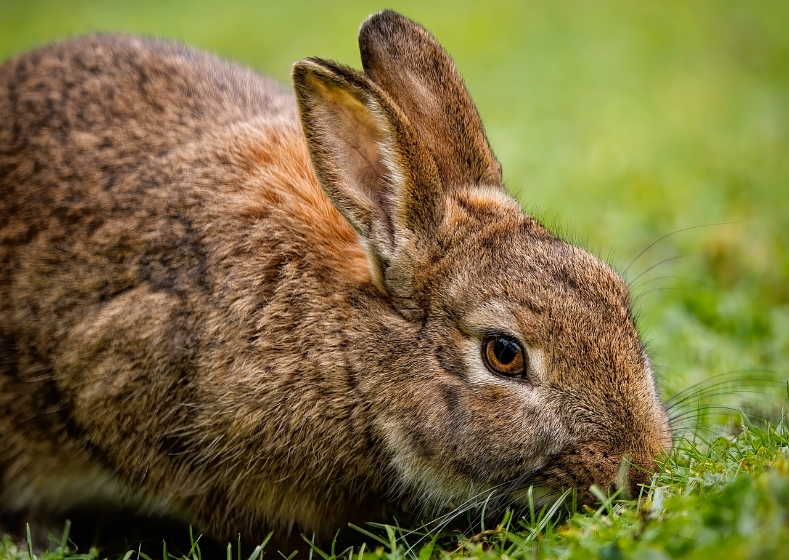

# Markdown Standard Test File
## Comprehensive Testing for Core Markdown Features

This file tests all the standard Markdown features as defined in the original specification, plus common extensions including media embedding.

---

## 1. Headings

# Heading Level 1
## Heading Level 2
### Heading Level 3
#### Heading Level 4
##### Heading Level 5
###### Heading Level 6

Heading with underline
=== 

Heading
---

# Heading Level 1:
## :Heading Level 2:
### :Heading Level 3
#### :Heading Level 4:
##### Heading Level 5:
###### :Heading Level 6:

## 2. Paragraphs

This is a simple paragraph. It contains some text that should wrap nicely when displayed.

This is another paragraph separated by a blank line. Blank lines between paragraphs are important in Markdown.

This is a paragraph with a line break  
created by adding two spaces at the end of a line.

## 3. Bold, Italic, Strikethrough, Highlight, Subscript, Superscript, and Code

**This is bold text** using double asterisks.  
__This is also bold__ using double underscores.

*This is italic text* using single asterisks.  
_This is also italic_ using single underscores.

**Bold text with *italic* inside** works correctly.  
_Italic text with **bold** inside_ also works.

***This is bold and italic*** using triple asterisks.  
___This is also bold and italic___ using triple underscores.

~~Strikethrough~~ using double tildes.

==Highlight== using double equals.

==**Bold Highlight**==

In*tra*word with asterisks

In_tra_word with underscores

In**tra**word with double asterisks

In__tra__word with double underscores. 

In***tra***word with both. 

In~~tra~~word with double tildes. 

In==tra==word with double equals

In==**tra**==word in bold highlight. 

*in**tra**word*

_in__tra__word_

__in_tra_word__

__in _tra_ word__

==in_tra_word==

==in***tra***word==

*foo *bar* baz*

Subscript: H~2~O (using single tilde).  
Superscript: X^2^ (using single caret).

`Inline code` with backticks.

```
Fenced code block using triple backticks
Line 2
Line 3
```

Term
: This is a definition of a term. 

~~~
Fenced code block using triple tildes
Line 2
Line 3
~~~

## 4. Links

### Inline links
This is a [link to GitHub](https://github.com).
Here's a [link with **bold** text](https://duckduckgo.com) inside.  
And a [link with _italic_ text](https://example.com) inside.
[This link has no title](https://example.com)
[Example with double-quoted title](https://example.com "This is a tooltip :smile:")
[Example with single-quoted title](https://example.com 'Hello World')
[Example with parenthesized title](https://example.com (Hello World))

### Reference links (new)
Here is a [reference link][github].
Here is a [reference link][duckduckgo] with a blank title.  
You can also use an [implicit reference][] where the link text itself becomes the id.

[github]: https://github.com "Optional title"

[duckduckgo]: https://duckduckgo.com ""

[implicit reference]: https://example.com

### Automatic links (new)
Plain URLs like https://example.com are now clickable.  
So are www.example.com addresses (automatically prefixed with http://).  
Email addresses like user@example.com also become mailto links.

Here is a simple footnote[^one], and here is another[^two]. Or how about a third[^three]?

[^one]: This is a footnote. 

[^two]: This is a worded footnote. 

[^three]: Hello, third

This is a fourth footnote[^four]. This is number 5[^five].

[^four]: Hello, fourth. 

[^five]: Hello, 5. 

Terms in Glossaries?

This is a footnote tied to a paragraph[^six].

[^six]: This is the first. 
 This is the second. 
 This is the third. 

## 5. Images

Local Image



Standard image with alt text:  

:

Image without alt text:  

:

## 6. Media (Video & Audio)

Videos and audio are automatically embedded using the standard image syntax when the file extension matches.

::  
*Big Buck Bunny (MP4) – public domain*

::  
*SoundHelix test track (MP3)*

  
*If a file named `video.mp4` exists, it will be embedded as a video player.*

  
*Similarly, an audio file will be embedded as an audio player.*

## 7. Blockquotes

> This is a simple blockquote.

> This is a blockquote with multiple lines.
> Blockquotes can span several lines.
> They keep the formatting intact.

> # Heading 1 inside blockquote
> ## Heading 2 inside blockquote
> ### Heading 3 inside blockquote
> #### Heading 4 inside blockquote
> ##### Heading 5 inside blockquote
> ###### Heading 6 inside blockquote
> 
> 1. Ordered list inside blockquote
>    * Unordered sub-item
>      * Deeper sub-item
> 
> And paragraphs too.

> This is the main blockquote
> 
>> This is a nested blockquote
>>> This is nested blockquote within a nested blockquote
>>> `Inline code inside nested blockquote`
> ```
> Fenced code inside blockquote
> Second line
> Third line
> ```

## 8. Lists

### Unordered Lists (using asterisks)
* Item **one**
* Item _two_
* Item ==three==
    * Nested item (indent with 4 spaces)
    * Another nested item
     > A nested blockquote
* Back to main list
 > A blockquote in a list


### Unordered Lists (using hyphens)
- First item
- Second item
- Third item
    - Nested with hyphen
    - Another nested
- Back to main list

### Unordered Lists (using plus signs)
+ Item one
+ Item two
+ Item three
    + Nested with plus
    + Another plus
+ Back to main list

### Ordered Lists
1. First item
2. Second item
3. Third item
    1. Nested ordered item
    2. Another nested item
4. Back to main list
> 

### Mixed Lists
1. First ordered item
   + Unordered sub-item
   + Another unordered sub-item
       + A sub-item within a sub-item
2. Second ordered item
   - Unordered sub-item
   - Another unordered sub-item
3. Third ordered item
   * Asterisk sub-item
   * Another one
4. Fourth ordered item
   + Unordered sub-item with \+
   - Unordered sub-item with \-
   * Unordered sub-item with \*
5. Fifth ordered item (testing indentation levels)
 - One space with hyphen
  - Two spaces with hyphen
 + One space with plus
  + Two spaces with plus
 * One space with asterisk
  * Two spaces with asterisk
   * Three spaces with asterisk

    > **Bold's One:** _The Esperanto flag emoji is represented by a combination of symbols that depict the flag's design, which features a green star on a white field. However, there is no official Unicode emoji for the Esperanto flag yet, but it can be created using a sequence of regional indicator symbols. This is italic text. And here is a second sentence for render testing._

6. Sixth ordered item (nested ordered with numbers)
    1. First nest (three spaces)
    2. Second nest
    3. Third nest

### Task Lists
- [x] Write the press release
- [ ] Update the website
- [ ] Contact the media
 - [x] Complete nested task
 - [ ] Incomplete nested task
  - [ ] Nested task with two spaces

### List with Formatting
- Item with **bold text**
- Item with _italic text_
- Item with ~~strikethrough~~
- Item with ==highlight==
- Item with ~subscript~
- Item with ^superscript^
- Item with `inline code`
- Item with [a link](https://example.com)
- Item with **bold and _italic_ together**

### Paragraphs in lists
- This is a single list item
  with a second line
  and a third line
  all in the same paragraph.
- This is a new item
  with a second line. This is a new paragraph inside the same item (separated by blank line).
 - This is a paragraph with a sub-item

## 9. Tables

Basic table with header and two rows:

| Header 1 | Header 2 |
|----------|----------|
| Cell 1   | Cell 2   |
| Cell 3   | Cell 4   |

Table with alignment (left, center, right):

| Left | Center | Right |
|:-----|:------:|------:|
| Left | Center | Right |
| Text | Text   | Text  |

Table with inline formatting:

| Formatting | Example |
|------------|---------|
| **Bold**   | **text** |
| *Italic*   | *text*   |
| `Code`     | `code`   |
| [Link](https://example.com) | [click](https://example.com) |
| ~~Strike~~ | ~~strike~~ |
| ==Highlight== | ==highlight== |
| H~2~O      | H~2~O    |
| X^2^       | X^2^     |

Table inside a blockquote:

> | Name  | Age |
> |-------|-----|
> | Alice | 25  |
> | Bob   | 30  |

Escaping pipe characters inside table cells (use backslash):

| Character | Example |
|-----------|---------|
| Pipe      | \|      |
| Backslash | \\      |

## 10. Horizontal Rules

---
(three hyphens)

- - -
(three hyphens with spaces)

*** 
(three asterisks)

* * * 
(three asterisks with spaces)

___ 
(three underscores)

_ _ _ 
(three underscores with spaces)

All six above should look the same: a horizontal line.

## 11. Inline HTML

This is <strong>strong text using HTML</strong> directly.

This is <em>emphasized text using HTML</em> directly.

This is <span style="color: red;">red text using HTML span</span>.

<p>This is a paragraph written in HTML.</p>

## 12. Line Breaks

This line has a line break  
created with two spaces at the end.

This line has another break  
right here.

## 13. Escaping Characters

Use \*\*double asterisks\*\* instead of **bold**.

Use \_underscores\_ instead of _italic_.

Use \~\~tildes\~\~ instead of ~~strikethrough~~.

Use \=\=equals\=\= instead of ==highlight==.

Use \~tilde\~ instead of ~subscript~.

Use \^caret\^ instead of ^superscript^.

Write \[brackets\] without making a link.

Use \| pipe without creating a table.

Use "\# Heading" to escape headings. 

\# Not a Heading

## 14. Multiple Features Combined

### A Real-World Example

# Product Review: The Ultimate Widget

## Overview

The **Ultimate Widget** is a revolutionary product that *everyone* is talking about. It supports H~2~O compatibility and speeds up to 10^3^ operations per second.

## Key Features

- **Durable construction** – lasts for years
- *Easy to use* – intuitive interface
- ~~Obsolete technology~~ removed
- ==New== ==highlighted== feature
- Affordable – great value for money
- [Official website](https://example.com/widget)

## What Users Are Saying

> I've been using this widget for months and it's **amazing**!  
> — *Satisfied Customer*

> The build quality is excellent. Highly recommended!  
> — *Tech Reviewer*

## Comparison

| Feature        | Our Widget | Competitor A | Competitor B |
|----------------|------------|--------------|--------------|
| Price          | $99        | $149         | $199         |
| Durability     | **Excellent** | Good       | Fair         |
| User Rating    | ★★★★★      | ★★★★☆        | ★★★☆☆        |

## Conclusion


The **Ultimate Widget** is worth every penny. [Buy it now](https://example.com)!

---

## 15.  Emoji Reference Tables

### Smileys & Emotion

| Shortcode | Description | Emoji |
|-----------|-------------|-------|
| `:100:` | 100 | :100: |
| `:alien:` | alien | :alien: |
| `:anger:` | anger | :anger: |
| `:angry:` | angry | :angry: |
| `:anguished:` | anguished | :anguished: |
| `:astonished:` | astonished | :astonished: |
| `:black_heart:` | black heart | :black_heart: |
| `:blush:` | blush | :blush: |
| `:boom:` | boom | :boom: |
| `:broken_heart:` | broken heart | :broken_heart: |
| `:brown_heart:` | brown heart | :brown_heart: |
| `:clown_face:` | clown face | :clown_face: |
| `:cold_face:` | cold face | :cold_face: |
| `:cold_sweat:` | cold sweat | :cold_sweat: |
| `:collision:` | collision | :collision: |
| `:confounded:` | confounded | :confounded: |
| `:confused:` | confused | :confused: |
| `:cowboy_hat_face:` | cowboy hat face | :cowboy_hat_face: |
| `:cry:` | cry | :cry: |
| `:crying_cat_face:` | crying cat face | :crying_cat_face: |
| `:cupid:` | cupid | :cupid: |
| `:cursing_face:` | cursing face | :cursing_face: |
| `:dash:` | dash | :dash: |
| `:disappointed:` | disappointed | :disappointed: |
| `:disappointed_relieved:` | disappointed relieved | :disappointed_relieved: |
| `:disguised_face:` | disguised face | :disguised_face: |
| `:dizzy:` | dizzy | :dizzy: |
| `:dizzy_face:` | dizzy face | :dizzy_face: |
| `:dotted_line_face:` | dotted line face | :dotted_line_face: |
| `:drooling_face:` | drooling face | :drooling_face: |
| `:exploding_head:` | exploding head | :exploding_head: |
| `:expressionless:` | expressionless | :expressionless: |
| `:face_exhaling:` | face exhaling | :face_exhaling: |
| `:face_holding_back_tears:` | face holding back tears | :face_holding_back_tears: |
| `:face_in_clouds:` | face in clouds | :face_in_clouds: |
| `:face_with_diagonal_mouth:` | face with diagonal mouth | :face_with_diagonal_mouth: |
| `:face_with_hand_over_mouth:` | face with hand over mouth | :face_with_hand_over_mouth: |
| `:face_with_head_bandage:` | face with head bandage | :face_with_head_bandage: |
| `:face_with_monocle:` | face with monocle | :face_with_monocle: |
| `:face_with_open_eyes_and_hand_over_mouth:` | face with open eyes and hand over mouth | :face_with_open_eyes_and_hand_over_mouth: |
| `:face_with_peeking_eye:` | face with peeking eye | :face_with_peeking_eye: |
| `:face_with_raised_eyebrow:` | face with raised eyebrow | :face_with_raised_eyebrow: |
| `:face_with_spiral_eyes:` | face with spiral eyes | :face_with_spiral_eyes: |
| `:face_with_thermometer:` | face with thermometer | :face_with_thermometer: |
| `:fearful:` | fearful | :fearful: |
| `:flushed:` | flushed | :flushed: |
| `:frowning:` | frowning | :frowning: |
| `:frowning_face:` | frowning face | :frowning_face: |
| `:ghost:` | ghost | :ghost: |
| `:gift_heart:` | gift heart | :gift_heart: |
| `:green_heart:` | green heart | :green_heart: |
| `:grey_heart:` | grey heart | :grey_heart: |
| `:grimacing:` | grimacing | :grimacing: |
| `:grin:` | grin | :grin: |
| `:grinning:` | grinning | :grinning: |
| `:hankey:` | hankey | :hankey: |
| `:heart:` | heart | :heart: |
| `:heart_decoration:` | heart decoration | :heart_decoration: |
| `:heart_eyes:` | heart eyes | :heart_eyes: |
| `:heart_eyes_cat:` | heart eyes cat | :heart_eyes_cat: |
| `:heart_on_fire:` | heart on fire | :heart_on_fire: |
| `:heartbeat:` | heartbeat | :heartbeat: |
| `:heartpulse:` | heartpulse | :heartpulse: |
| `:heavy_heart_exclamation:` | heavy heart exclamation | :heavy_heart_exclamation: |
| `:hole:` | hole | :hole: |
| `:hot_face:` | hot face | :hot_face: |
| `:hugging_face:` | hugging face | :hugging_face: |
| `:hushed:` | hushed | :hushed: |
| `:imp:` | imp | :imp: |
| `:innocent:` | innocent | :innocent: |
| `:japanese_goblin:` | japanese goblin | :japanese_goblin: |
| `:japanese_ogre:` | japanese ogre | :japanese_ogre: |
| `:joy:` | joy | :joy: |
| `:joy_cat:` | joy cat | :joy_cat: |
| `:kiss:` | kiss | :kiss: |
| `:kissing:` | kissing | :kissing: |
| `:kissing_cat:` | kissing cat | :kissing_cat: |
| `:kissing_closed_eyes:` | kissing closed eyes | :kissing_closed_eyes: |
| `:kissing_heart:` | kissing heart | :kissing_heart: |
| `:kissing_smiling_eyes:` | kissing smiling eyes | :kissing_smiling_eyes: |
| `:laughing:` | laughing | :laughing: |
| `:left_speech_bubble:` | left speech bubble | :left_speech_bubble: |
| `:light_blue_heart:` | light blue heart | :light_blue_heart: |
| `:love_letter:` | love letter | :love_letter: |
| `:lying_face:` | lying face | :lying_face: |
| `:mask:` | mask | :mask: |
| `:melting_face:` | melting face | :melting_face: |
| `:mending_heart:` | mending heart | :mending_heart: |
| `:money_mouth_face:` | money mouth face | :money_mouth_face: |
| `:nauseated_face:` | nauseated face | :nauseated_face: |
| `:nerd_face:` | nerd face | :nerd_face: |
| `:neutral_face:` | neutral face | :neutral_face: |
| `:no_mouth:` | no mouth | :no_mouth: |
| `:open_mouth:` | open mouth | :open_mouth: |
| `:orange_heart:` | orange heart | :orange_heart: |
| `:partying_face:` | partying face | :partying_face: |
| `:pensive:` | pensive | :pensive: |
| `:persevere:` | persevere | :persevere: |
| `:pink_heart:` | pink heart | :pink_heart: |
| `:pleading_face:` | pleading face | :pleading_face: |
| `:poop:` | poop | :poop: |
| `:pouting_cat:` | pouting cat | :pouting_cat: |
| `:purple_heart:` | purple heart | :purple_heart: |
| `:rage:` | rage | :rage: |
| `:relaxed:` | relaxed | :relaxed: |
| `:relieved:` | relieved | :relieved: |
| `:revolving_hearts:` | revolving hearts | :revolving_hearts: |
| `:right_anger_bubble:` | right anger bubble | :right_anger_bubble: |
| `:robot:` | robot | :robot: |
| `:rofl:` | rofl | :rofl: |
| `:roll_eyes:` | roll eyes | :roll_eyes: |
| `:scream:` | scream | :scream: |
| `:scream_cat:` | scream cat | :scream_cat: |
| `:see_no_evil:` | see no evil | :see_no_evil: |
| `:shaking_face:` | shaking face | :shaking_face: |
| `:shit:` | shit | :shit: |
| `:shushing_face:` | shushing face | :shushing_face: |
| `:skull:` | skull | :skull: |
| `:skull_and_crossbones:` | skull and crossbones | :skull_and_crossbones: |
| `:sleeping:` | sleeping | :sleeping: |
| `:sleepy:` | sleepy | :sleepy: |
| `:slightly_frowning_face:` | slightly frowning face | :slightly_frowning_face: |
| `:slightly_smiling_face:` | slightly smiling face | :slightly_smiling_face: |
| `:smile:` | smile | :smile: |
| `:smile_cat:` | smile cat | :smile_cat: |
| `:smiley:` | smiley | :smiley: |
| `:smiley_cat:` | smiley cat | :smiley_cat: |
| `:smiling_face_with_3_hearts:` | smiling face with 3 hearts | :smiling_face_with_3_hearts: |
| `:smiling_face_with_tear:` | smiling face with tear | :smiling_face_with_tear: |
| `:smiling_imp:` | smiling imp | :smiling_imp: |
| `:smirk:` | smirk | :smirk: |
| `:smirk_cat:` | smirk cat | :smirk_cat: |
| `:sob:` | sob | :sob: |
| `:space_invader:` | space invader | :space_invader: |
| `:sparkling_heart:` | sparkling heart | :sparkling_heart: |
| `:speak_no_evil:` | speak no evil | :speak_no_evil: |
| `:speech_balloon:` | speech balloon | :speech_balloon: |
| `:star_struck:` | star struck | :star_struck: |
| `:stuck_out_tongue:` | stuck out tongue | :stuck_out_tongue: |
| `:stuck_out_tongue_closed_eyes:` | stuck out tongue closed eyes | :stuck_out_tongue_closed_eyes: |
| `:stuck_out_tongue_winking_eye:` | stuck out tongue winking eye | :stuck_out_tongue_winking_eye: |
| `:sunglasses:` | sunglasses | :sunglasses: |
| `:sweat:` | sweat | :sweat: |
| `:sweat_drops:` | sweat drops | :sweat_drops: |
| `:sweat_smile:` | sweat smile | :sweat_smile: |
| `:thinking_face:` | thinking face | :thinking_face: |
| `:thought_balloon:` | thought balloon | :thought_balloon: |
| `:tired_face:` | tired face | :tired_face: |
| `:triumph:` | triumph | :triumph: |
| `:two_hearts:` | two hearts | :two_hearts: |
| `:unamused:` | unamused | :unamused: |
| `:upside_down_face:` | upside down face | :upside_down_face: |
| `:vomiting_face:` | vomiting face | :vomiting_face: |
| `:weary:` | weary | :weary: |
| `:white_heart:` | white heart | :white_heart: |
| `:wink:` | wink | :wink: |
| `:woozy_face:` | woozy face | :woozy_face: |
| `:worried:` | worried | :worried: |
| `:yawning_face:` | yawning face | :yawning_face: |
| `:yellow_heart:` | yellow heart | :yellow_heart: |
| `:yum:` | yum | :yum: |
| `:zany_face:` | zany face | :zany_face: |
| `:zipper_mouth_face:` | zipper mouth face | :zipper_mouth_face: |
| `:zzz:` | zzz | :zzz: |

### Hand Gestures

| Shortcode | Description | Emoji |
|-----------|-------------|-------|
| `:wave:` | wave | :wave: |
| `:raised_back_of_hand:` | raised back of hand | :raised_back_of_hand: |
| `:raised_hand_with_fingers_splayed:` | raised hand with fingers splayed | :raised_hand_with_fingers_splayed: |
| `:hand:` | hand | :hand: |
| `:raised_hand:` | raised hand | :raised_hand: |
| `:vulcan_salute:` | vulcan salute | :vulcan_salute: |
| `:rightwards_hand:` | rightwards hand | :rightwards_hand: |
| `:leftwards_hand:` | leftwards hand | :leftwards_hand: |
| `:palm_down_hand:` | palm down hand | :palm_down_hand: |
| `:palm_up_hand:` | palm up hand | :palm_up_hand: |
| `:leftwards_pushing_hand:` | leftwards pushing hand | :leftwards_pushing_hand: |
| `:rightwards_pushing_hand:` | rightwards pushing hand | :rightwards_pushing_hand: |
| `:ok_hand:` | ok hand | :ok_hand: |
| `:pinched_fingers:` | pinched fingers | :pinched_fingers: |
| `:pinching_hand:` | pinching hand | :pinching_hand: |
| `:victory:` | victory | :victory: |
| `:crossed_fingers:` | crossed fingers | :crossed_fingers: |
| `:hand_with_index_finger_and_thumb_crossed:` | hand with index finger and thumb crossed | :hand_with_index_finger_and_thumb_crossed: |
| `:love_you_gesture:` | love you gesture | :love_you_gesture: |
| `:metal:` | metal | :metal: |
| `:call_me_hand:` | call me hand | :call_me_hand: |
| `:point_left:` | point left | :point_left: |
| `:point_right:` | point right | :point_right: |
| `:point_up_2:` | point up 2 | :point_up_2: |
| `:point_down:` | point down | :point_down: |
| `:point_up:` | point up | :point_up: |
| `:raised_fist:` | raised fist | :raised_fist: |
| `:fist:` | fist | :fist: |
| `:punch:` | punch | :punch: |
| `:left_facing_fist:` | left facing fist | :left_facing_fist: |
| `:right_facing_fist:` | right facing fist | :right_facing_fist: |
| `:clap:` | clap | :clap: |
| `:raised_hands:` | raised hands | :raised_hands: |
| `:heart_hands:` | heart hands | :heart_hands: |
| `:open_hands:` | open hands | :open_hands: |
| `:palms_up_together:` | palms up together | :palms_up_together: |
| `:handshake:` | handshake | :handshake: |
| `:pray:` | pray | :pray: |
| `:writing_hand:` | writing hand | :writing_hand: |
| `:nail_care:` | nail care | :nail_care: |
| `:selfie:` | selfie | :selfie: |
| `:muscle:` | muscle | :muscle: |
| `:mechanical_arm:` | mechanical arm | :mechanical_arm: |
| `:mechanical_leg:` | mechanical leg | :mechanical_leg: |
| `:leg:` | leg | :leg: |
| `:foot:` | foot | :foot: |
| `:ear:` | ear | :ear: |
| `:ear_with_hearing_aid:` | ear with hearing aid | :ear_with_hearing_aid: |
| `:nose:` | nose | :nose: |
| `:brain:` | brain | :brain: |
| `:anatomical_heart:` | anatomical heart | :anatomical_heart: |
| `:lungs:` | lungs | :lungs: |
| `:tooth:` | tooth | :tooth: |
| `:bone:` | bone | :bone: |
| `:eyes:` | eyes | :eyes: |
| `:eye:` | eye | :eye: |
| `:tongue:` | tongue | :tongue: |
| `:lips:` | lips | :lips: |
| `:biting_lip:` | biting lip | :biting_lip: |
| `:thumbsup:` | thumbsup | :thumbsup: |
| `:thumbsdown:` | thumbsdown | :thumbsdown: |

### People & Body (excluding hand gestures)

| Shortcode | Description | Emoji |
|-----------|-------------|-------|
| `:baby:` | baby | :baby: |
| `:child:` | child | :child: |
| `:boy:` | boy | :boy: |
| `:girl:` | girl | :girl: |
| `:adult:` | adult | :adult: |
| `:person:` | person | :person: |
| `:blond_haired_person:` | blond haired person | :blond_haired_person: |
| `:man:` | man | :man: |
| `:woman:` | woman | :woman: |
| `:older_adult:` | older adult | :older_adult: |
| `:older_man:` | older man | :older_man: |
| `:older_woman:` | older woman | :older_woman: |
| `:person_frowning:` | person frowning | :person_frowning: |
| `:person_pouting:` | person pouting | :person_pouting: |
| `:person_gesturing_no:` | person gesturing no | :person_gesturing_no: |
| `:person_gesturing_ok:` | person gesturing ok | :person_gesturing_ok: |
| `:person_tipping_hand:` | person tipping hand | :person_tipping_hand: |
| `:person_raising_hand:` | person raising hand | :person_raising_hand: |
| `:deaf_person:` | deaf person | :deaf_person: |
| `:person_bowing:` | person bowing | :person_bowing: |
| `:person_facepalming:` | person facepalming | :person_facepalming: |
| `:person_shrugging:` | person shrugging | :person_shrugging: |
| `:health_worker:` | health worker | :health_worker: |
| `:student:` | student | :student: |
| `:teacher:` | teacher | :teacher: |
| `:judge:` | judge | :judge: |
| `:farmer:` | farmer | :farmer: |
| `:cook:` | cook | :cook: |
| `:mechanic:` | mechanic | :mechanic: |
| `:factory_worker:` | factory worker | :factory_worker: |
| `:office_worker:` | office worker | :office_worker: |
| `:scientist:` | scientist | :scientist: |
| `:technologist:` | technologist | :technologist: |
| `:singer:` | singer | :singer: |
| `:artist:` | artist | :artist: |
| `:pilot:` | pilot | :pilot: |
| `:astronaut:` | astronaut | :astronaut: |
| `:firefighter:` | firefighter | :firefighter: |
| `:people_holding_hands:` | people holding hands | :people_holding_hands: |
| `:couple:` | couple | :couple: |
| `:two_men_holding_hands:` | two men holding hands | :two_men_holding_hands: |
| `:two_women_holding_hands:` | two women holding hands | :two_women_holding_hands: |
| `:family:` | family | :family: |
| `:family_man_woman_boy:` | family man woman boy | :family_man_woman_boy: |
| `:family_man_woman_girl:` | family man woman girl | :family_man_woman_girl: |
| `:family_man_woman_girl_boy:` | family man woman girl boy | :family_man_woman_girl_boy: |
| `:family_man_man_boy:` | family man man boy | :family_man_man_boy: |
| `:family_man_man_girl:` | family man man girl | :family_man_man_girl: |
| `:family_man_man_girl_boy:` | family man man girl boy | :family_man_man_girl_boy: |
| `:family_man_man_boy_boy:` | family man man boy boy | :family_man_man_boy_boy: |
| `:family_man_man_girl_girl:` | family man man girl girl | :family_man_man_girl_girl: |
| `:family_woman_woman_boy:` | family woman woman boy | :family_woman_woman_boy: |
| `:family_woman_woman_girl:` | family woman woman girl | :family_woman_woman_girl: |
| `:family_woman_woman_girl_boy:` | family woman woman girl boy | :family_woman_woman_girl_boy: |
| `:family_woman_woman_boy_boy:` | family woman woman boy boy | :family_woman_woman_boy_boy: |
| `:family_woman_woman_girl_girl:` | family woman woman girl girl | :family_woman_woman_girl_girl: |
| `:family_man_boy:` | family man boy | :family_man_boy: |
| `:family_man_boy_boy:` | family man boy boy | :family_man_boy_boy: |
| `:family_man_girl:` | family man girl | :family_man_girl: |
| `:family_man_girl_boy:` | family man girl boy | :family_man_girl_boy: |
| `:family_man_girl_girl:` | family man girl girl | :family_man_girl_girl: |
| `:family_woman_boy:` | family woman boy | :family_woman_boy: |
| `:family_woman_boy_boy:` | family woman boy boy | :family_woman_boy_boy: |
| `:family_woman_girl:` | family woman girl | :family_woman_girl: |
| `:family_woman_girl_boy:` | family woman girl boy | :family_woman_girl_boy: |
| `:family_woman_girl_girl:` | family woman girl girl | :family_woman_girl_girl: |
| `:person_bald:` | person bald | :person_bald: |
| `:person_curly_hair:` | person curly hair | :person_curly_hair: |
| `:person_red_hair:` | person red hair | :person_red_hair: |
| `:person_white_hair:` | person white hair | :person_white_hair: |
| `:man_bald:` | man bald | :man_bald: |
| `:man_curly_hair:` | man curly hair | :man_curly_hair: |
| `:man_red_hair:` | man red hair | :man_red_hair: |
| `:man_white_hair:` | man white hair | :man_white_hair: |
| `:woman_bald:` | woman bald | :woman_bald: |
| `:woman_curly_hair:` | woman curly hair | :woman_curly_hair: |
| `:woman_red_hair:` | woman red hair | :woman_red_hair: |
| `:woman_white_hair:` | woman white hair | :woman_white_hair: |
| `:person_beard:` | person beard | :person_beard: |
| `:man_beard:` | man beard | :man_beard: |
| `:woman_beard:` | woman beard | :woman_beard: |
| `:man_with_chinese_cap:` | man with chinese cap | :man_with_chinese_cap: |
| `:man_with_turban:` | man with turban | :man_with_turban: |
| `:woman_with_turban:` | woman with turban | :woman_with_turban: |
| `:man_with_skullcap:` | man with skullcap | :man_with_skullcap: |
| `:woman_with_headscarf:` | woman with headscarf | :woman_with_headscarf: |
| `:man_in_tuxedo:` | man in tuxedo | :man_in_tuxedo: |
| `:woman_in_tuxedo:` | woman in tuxedo | :woman_in_tuxedo: |
| `:man_with_veil:` | man with veil | :man_with_veil: |
| `:woman_with_veil:` | woman with veil | :woman_with_veil: |
| `:pregnant_woman:` | pregnant woman | :pregnant_woman: |
| `:breastfeeding:` | breastfeeding | :breastfeeding: |
| `:woman_feeding_baby:` | woman feeding baby | :woman_feeding_baby: |
| `:man_feeding_baby:` | man feeding baby | :man_feeding_baby: |
| `:person_feeding_baby:` | person feeding baby | :person_feeding_baby: |
| `:angel:` | angel | :angel: |
| `:santa:` | santa | :santa: |
| `:mrs_claus:` | mrs claus | :mrs_claus: |
| `:mx_claus:` | mx claus | :mx_claus: |
| `:superhero:` | superhero | :superhero: |
| `:supervillain:` | supervillain | :supervillain: |
| `:mage:` | mage | :mage: |
| `:fairy:` | fairy | :fairy: |
| `:vampire:` | vampire | :vampire: |
| `:merperson:` | merperson | :merperson: |
| `:elf:` | elf | :elf: |
| `:genie:` | genie | :genie: |
| `:zombie:` | zombie | :zombie: |
| `:troll:` | troll | :troll: |
| `:person_getting_massage:` | person getting massage | :person_getting_massage: |
| `:person_getting_haircut:` | person getting haircut | :person_getting_haircut: |
| `:person_walking:` | person walking | :person_walking: |
| `:person_standing:` | person standing | :person_standing: |
| `:person_kneeling:` | person kneeling | :person_kneeling: |
| `:person_with_probing_cane:` | person with probing cane | :person_with_probing_cane: |
| `:person_in_motorized_wheelchair:` | person in motorized wheelchair | :person_in_motorized_wheelchair: |
| `:person_in_manual_wheelchair:` | person in manual wheelchair | :person_in_manual_wheelchair: |
| `:person_running:` | person running | :person_running: |
| `:woman_running:` | woman running | :woman_running: |
| `:man_running:` | man running | :man_running: |
| `:dancer:` | dancer | :dancer: |
| `:man_dancing:` | man dancing | :man_dancing: |
| `:person_in_suit_levitating:` | person in suit levitating | :person_in_suit_levitating: |
| `:people_with_bunny_ears:` | people with bunny ears | :people_with_bunny_ears: |
| `:person_in_steamy_room:` | person in steamy room | :person_in_steamy_room: |
| `:person_climbing:` | person climbing | :person_climbing: |
| `:person_in_lotus_position:` | person in lotus position | :person_in_lotus_position: |
| `:person_taking_bath:` | person taking bath | :person_taking_bath: |
| `:person_in_bed:` | person in bed | :person_in_bed: |
| `:people_wrestling:` | people wrestling | :people_wrestling: |
| `:person_playing_water_polo:` | person playing water polo | :person_playing_water_polo: |
| `:person_playing_handball:` | person playing handball | :person_playing_handball: |
| `:person_juggling:` | person juggling | :person_juggling: |

### Activities

| Shortcode | Description | Emoji |
|-----------|-------------|-------|
| `:badminton:` | badminton | :badminton: |
| `:baseball:` | baseball | :baseball: |
| `:basketball:` | basketball | :basketball: |
| `:bicycle:` | bicycle | :bicycle: |
| `:biking:` | biking | :biking: |
| `:black_joker:` | black joker | :black_joker: |
| `:bowling:` | bowling | :bowling: |
| `:boxing_glove:` | boxing glove | :boxing_glove: |
| `:chess_pawn:` | chess pawn | :chess_pawn: |
| `:clubs:` | clubs | :clubs: |
| `:cocktail:` | cocktail | :cocktail: |
| `:cricket_game:` | cricket game | :cricket_game: |
| `:curling_stone:` | curling stone | :curling_stone: |
| `:dart:` | dart | :dart: |
| `:diamonds:` | diamonds | :diamonds: |
| `:diving_mask:` | diving mask | :diving_mask: |
| `:fencing:` | fencing | :fencing: |
| `:field_hockey:` | field hockey | :field_hockey: |
| `:fishing_pole_and_fish:` | fishing pole and fish | :fishing_pole_and_fish: |
| `:flying_disc:` | flying disc | :flying_disc: |
| `:football:` | football | :football: |
| `:game_die:` | game die | :game_die: |
| `:goal_net:` | goal net | :goal_net: |
| `:golf:` | golf | :golf: |
| `:guitar:` | guitar | :guitar: |
| `:handball:` | handball | :handball: |
| `:hearts:` | hearts | :hearts: |
| `:ice_hockey:` | ice hockey | :ice_hockey: |
| `:ice_skate:` | ice skate | :ice_skate: |
| `:joystick:` | joystick | :joystick: |
| `:kite:` | kite | :kite: |
| `:lacrosse:` | lacrosse | :lacrosse: |
| `:mahjong:` | mahjong | :mahjong: |
| `:martial_arts_uniform:` | martial arts uniform | :martial_arts_uniform: |
| `:microphone:` | microphone | :microphone: |
| `:mountain_biking:` | mountain biking | :mountain_biking: |
| `:movie_camera:` | movie camera | :movie_camera: |
| `:musical_keyboard:` | musical keyboard | :musical_keyboard: |
| `:musical_note:` | musical note | :musical_note: |
| `:musical_score:` | musical score | :musical_score: |
| `:notes:` | notes | :notes: |
| `:parachute:` | parachute | :parachute: |
| `:performing_arts:` | performing arts | :performing_arts: |
| `:ping_pong:` | ping pong | :ping_pong: |
| `:pool_8_ball:` | pool 8 ball | :pool_8_ball: |
| `:reminder_ribbon:` | reminder ribbon | :reminder_ribbon: |
| `:roller_coaster:` | roller coaster | :roller_coaster: |
| `:rowing:` | rowing | :rowing: |
| `:rugby_football:` | rugby football | :rugby_football: |
| `:running_shirt_with_sash:` | running shirt with sash | :running_shirt_with_sash: |
| `:sailboat:` | sailboat | :sailboat: |
| `:saxophone:` | saxophone | :saxophone: |
| `:ski:` | ski | :ski: |
| `:sled:` | sled | :sled: |
| `:slot_machine:` | slot machine | :slot_machine: |
| `:snowboarder:` | snowboarder | :snowboarder: |
| `:soccer:` | soccer | :soccer: |
| `:softball:` | softball | :softball: |
| `:spades:` | spades | :spades: |
| `:surfer:` | surfer | :surfer: |
| `:swimmer:` | swimmer | :swimmer: |
| `:tennis:` | tennis | :tennis: |
| `:ticket:` | ticket | :ticket: |
| `:trophy:` | trophy | :trophy: |
| `:trumpet:` | trumpet | :trumpet: |
| `:video_game:` | video game | :video_game: |
| `:violin:` | violin | :violin: |
| `:volleyball:` | volleyball | :volleyball: |
| `:weight_lifter:` | weight lifter | :weight_lifter: |
| `:yo_yo:` | yo yo | :yo_yo: |

### Objects

| Shortcode | Description | Emoji |
|-----------|-------------|-------|
| `:mute:` | mute | :mute: |
| `:speaker:` | speaker | :speaker: |
| `:sound:` | sound | :sound: |
| `:loud_sound:` | loud sound | :loud_sound: |
| `:loudspeaker:` | loudspeaker | :loudspeaker: |
| `:mega:` | mega | :mega: |
| `:postal_horn:` | postal horn | :postal_horn: |
| `:bell:` | bell | :bell: |
| `:no_bell:` | no bell | :no_bell: |
| `:musical_score:` | musical score | :musical_score: |
| `:musical_note:` | musical note | :musical_note: |
| `:notes:` | notes | :notes: |
| `:studio_microphone:` | studio microphone | :studio_microphone: |
| `:level_slider:` | level slider | :level_slider: |
| `:control_knobs:` | control knobs | :control_knobs: |
| `:microphone:` | microphone | :microphone: |
| `:headphones:` | headphones | :headphones: |
| `:radio:` | radio | :radio: |
| `:saxophone:` | saxophone | :saxophone: |
| `:accordion:` | accordion | :accordion: |
| `:guitar:` | guitar | :guitar: |
| `:musical_keyboard:` | musical keyboard | :musical_keyboard: |
| `:trumpet:` | trumpet | :trumpet: |
| `:violin:` | violin | :violin: |
| `:banjo:` | banjo | :banjo: |
| `:drum:` | drum | :drum: |
| `:long_drum:` | long drum | :long_drum: |
| `:maracas:` | maracas | :maracas: |
| `:flute:` | flute | :flute: |
| `:telephone:` | telephone | :telephone: |
| `:telephone_receiver:` | telephone receiver | :telephone_receiver: |
| `:pager:` | pager | :pager: |
| `:fax:` | fax | :fax: |
| `:battery:` | battery | :battery: |
| `:low_battery:` | low battery | :low_battery: |
| `:electric_plug:` | electric plug | :electric_plug: |
| `:computer:` | computer | :computer: |
| `:desktop_computer:` | desktop computer | :desktop_computer: |
| `:printer:` | printer | :printer: |
| `:keyboard:` | keyboard | :keyboard: |
| `:computer_mouse:` | computer mouse | :computer_mouse: |
| `:trackball:` | trackball | :trackball: |
| `:minidisc:` | minidisc | :minidisc: |
| `:floppy_disk:` | floppy disk | :floppy_disk: |
| `:cd:` | cd | :cd: |
| `:dvd:` | dvd | :dvd: |
| `:abacus:` | abacus | :abacus: |
| `:movie_camera:` | movie camera | :movie_camera: |
| `:film_strip:` | film strip | :film_strip: |
| `:film_projector:` | film projector | :film_projector: |
| `:clapper:` | clapper | :clapper: |
| `:tv:` | tv | :tv: |
| `:camera:` | camera | :camera: |
| `:camera_flash:` | camera flash | :camera_flash: |
| `:video_camera:` | video camera | :video_camera: |
| `:videocassette:` | videocassette | :videocassette: |
| `:mag:` | mag | :mag: |
| `:mag_right:` | mag right | :mag_right: |
| `:candle:` | candle | :candle: |
| `:bulb:` | bulb | :bulb: |
| `:flashlight:` | flashlight | :flashlight: |
| `:izakaya_lantern:` | izakaya lantern | :izakaya_lantern: |
| `:diya_lamp:` | diya lamp | :diya_lamp: |
| `:notebook_with_decorative_cover:` | notebook with decorative cover | :notebook_with_decorative_cover: |
| `:closed_book:` | closed book | :closed_book: |
| `:book:` | book | :book: |
| `:green_book:` | green book | :green_book: |
| `:blue_book:` | blue book | :blue_book: |
| `:orange_book:` | orange book | :orange_book: |
| `:books:` | books | :books: |
| `:notebook:` | notebook | :notebook: |
| `:ledger:` | ledger | :ledger: |
| `:page_with_curl:` | page with curl | :page_with_curl: |
| `:scroll:` | scroll | :scroll: |
| `:page_facing_up:` | page facing up | :page_facing_up: |
| `:newspaper:` | newspaper | :newspaper: |
| `:rolled_up_newspaper:` | rolled up newspaper | :rolled_up_newspaper: |
| `:bookmark_tabs:` | bookmark tabs | :bookmark_tabs: |
| `:bookmark:` | bookmark | :bookmark: |
| `:label:` | label | :label: |
| `:moneybag:` | moneybag | :moneybag: |
| `:coin:` | coin | :coin: |
| `:yen:` | yen | :yen: |
| `:dollar:` | dollar | :dollar: |
| `:euro:` | euro | :euro: |
| `:pound:` | pound | :pound: |
| `:money_with_wings:` | money with wings | :money_with_wings: |
| `:credit_card:` | credit card | :credit_card: |
| `:receipt:` | receipt | :receipt: |
| `:chart:` | chart | :chart: |
| `:envelope:` | envelope | :envelope: |
| `:e-mail:` | e-mail | :e-mail: |
| `:incoming_envelope:` | incoming envelope | :incoming_envelope: |
| `:envelope_with_arrow:` | envelope with arrow | :envelope_with_arrow: |
| `:outbox_tray:` | outbox tray | :outbox_tray: |
| `:inbox_tray:` | inbox tray | :inbox_tray: |
| `:package:` | package | :package: |
| `:mailbox:` | mailbox | :mailbox: |
| `:mailbox_closed:` | mailbox closed | :mailbox_closed: |
| `:mailbox_with_mail:` | mailbox with mail | :mailbox_with_mail: |
| `:mailbox_with_no_mail:` | mailbox with no mail | :mailbox_with_no_mail: |
| `:postbox:` | postbox | :postbox: |
| `:ballot_box:` | ballot box | :ballot_box: |
| `:pencil2:` | pencil2 | :pencil2: |
| `:black_nib:` | black nib | :black_nib: |
| `:fountain_pen:` | fountain pen | :fountain_pen: |
| `:pen:` | pen | :pen: |
| `:paintbrush:` | paintbrush | :paintbrush: |
| `:crayon:` | crayon | :crayon: |
| `:memo:` | memo | :memo: |
| `:briefcase:` | briefcase | :briefcase: |
| `:file_folder:` | file folder | :file_folder: |
| `:open_file_folder:` | open file folder | :open_file_folder: |
| `:card_index_dividers:` | card index dividers | :card_index_dividers: |
| `:date:` | date | :date: |
| `:calendar:` | calendar | :calendar: |
| `:spiral_notepad:` | spiral notepad | :spiral_notepad: |
| `:spiral_calendar:` | spiral calendar | :spiral_calendar: |
| `:card_index:` | card index | :card_index: |
| `:chart_with_upwards_trend:` | chart with upwards trend | :chart_with_upwards_trend: |
| `:chart_with_downwards_trend:` | chart with downwards trend | :chart_with_downwards_trend: |
| `:bar_chart:` | bar chart | :bar_chart: |
| `:clipboard:` | clipboard | :clipboard: |
| `:pushpin:` | pushpin | :pushpin: |
| `:round_pushpin:` | round pushpin | :round_pushpin: |
| `:paperclip:` | paperclip | :paperclip: |
| `:linked_paperclips:` | linked paperclips | :linked_paperclips: |
| `:straight_ruler:` | straight ruler | :straight_ruler: |
| `:triangular_ruler:` | triangular ruler | :triangular_ruler: |
| `:scissors:` | scissors | :scissors: |
| `:card_file_box:` | card file box | :card_file_box: |
| `:file_cabinet:` | file cabinet | :file_cabinet: |
| `:wastebasket:` | wastebasket | :wastebasket: |
| `:lock:` | lock | :lock: |
| `:unlock:` | unlock | :unlock: |
| `:lock_with_ink_pen:` | lock with ink pen | :lock_with_ink_pen: |
| `:closed_lock_with_key:` | closed lock with key | :closed_lock_with_key: |
| `:key:` | key | :key: |
| `:old_key:` | old key | :old_key: |
| `:hammer:` | hammer | :hammer: |
| `:axe:` | axe | :axe: |
| `:pick:` | pick | :pick: |
| `:hammer_and_pick:` | hammer and pick | :hammer_and_pick: |
| `:hammer_and_wrench:` | hammer and wrench | :hammer_and_wrench: |
| `:dagger:` | dagger | :dagger: |
| `:crossed_swords:` | crossed swords | :crossed_swords: |
| `:bomb:` | bomb | :bomb: |
| `:boomerang:` | boomerang | :boomerang: |
| `:bow_and_arrow:` | bow and arrow | :bow_and_arrow: |
| `:shield:` | shield | :shield: |
| `:carpentry_saw:` | carpentry saw | :carpentry_saw: |
| `:wrench:` | wrench | :wrench: |
| `:screwdriver:` | screwdriver | :screwdriver: |
| `:nut_and_bolt:` | nut and bolt | :nut_and_bolt: |
| `:gear:` | gear | :gear: |
| `:clamp:` | clamp | :clamp: |
| `:balance_scale:` | balance scale | :balance_scale: |
| `:white_cane:` | white cane | :white_cane: |
| `:link:` | link | :link: |
| `:chains:` | chains | :chains: |
| `:hook:` | hook | :hook: |
| `:toolbox:` | toolbox | :toolbox: |
| `:magnet:` | magnet | :magnet: |
| `:ladder:` | ladder | :ladder: |
| `:alembic:` | alembic | :alembic: |
| `:test_tube:` | test tube | :test_tube: |
| `:petri_dish:` | petri dish | :petri_dish: |
| `:dna:` | dna | :dna: |
| `:microscope:` | microscope | :microscope: |
| `:telescope:` | telescope | :telescope: |
| `:satellite_antenna:` | satellite antenna | :satellite_antenna: |
| `:syringe:` | syringe | :syringe: |
| `:drop_of_blood:` | drop of blood | :drop_of_blood: |
| `:pill:` | pill | :pill: |
| `:adhesive_bandage:` | adhesive bandage | :adhesive_bandage: |
| `:crutch:` | crutch | :crutch: |
| `:stethoscope:` | stethoscope | :stethoscope: |
| `:x_ray:` | x ray | :x_ray: |
| `:door:` | door | :door: |
| `:elevator:` | elevator | :elevator: |
| `:mirror:` | mirror | :mirror: |
| `:window:` | window | :window: |
| `:bed:` | bed | :bed: |
| `:couch_and_lamp:` | couch and lamp | :couch_and_lamp: |
| `:chair:` | chair | :chair: |
| `:toilet:` | toilet | :toilet: |
| `:plunger:` | plunger | :plunger: |
| `:shower:` | shower | :shower: |
| `:bathtub:` | bathtub | :bathtub: |
| `:mouse_trap:` | mouse trap | :mouse_trap: |
| `:razor:` | razor | :razor: |
| `:lotion_bottle:` | lotion bottle | :lotion_bottle: |
| `:safety_pin:` | safety pin | :safety_pin: |
| `:broom:` | broom | :broom: |
| `:basket:` | basket | :basket: |
| `:roll_of_paper:` | roll of paper | :roll_of_paper: |
| `:bucket:` | bucket | :bucket: |
| `:soap:` | soap | :soap: |
| `:toothbrush:` | toothbrush | :toothbrush: |
| `:sponge:` | sponge | :sponge: |
| `:fire_extinguisher:` | fire extinguisher | :fire_extinguisher: |
| `:shopping_cart:` | shopping cart | :shopping_cart: |
| `:smoking:` | smoking | :smoking: |
| `:coffin:` | coffin | :coffin: |
| `:headstone:` | headstone | :headstone: |
| `:funeral_urn:` | funeral urn | :funeral_urn: |
| `:moyai:` | moyai | :moyai: |
| `:placard:` | placard | :placard: |
| `:identification_card:` | identification card | :identification_card: |

### Travel & Places

| Shortcode | Description | Emoji |
|-----------|-------------|-------|
| `:earth_africa:` | earth africa | :earth_africa: |
| `:earth_americas:` | earth americas | :earth_americas: |
| `:earth_asia:` | earth asia | :earth_asia: |
| `:globe_with_meridians:` | globe with meridians | :globe_with_meridians: |
| `:world_map:` | world map | :world_map: |
| `:japan:` | japan | :japan: |
| `:compass:` | compass | :compass: |
| `:snow_capped_mountain:` | snow capped mountain | :snow_capped_mountain: |
| `:mountain:` | mountain | :mountain: |
| `:volcano:` | volcano | :volcano: |
| `:mount_fuji:` | mount fuji | :mount_fuji: |
| `:camping:` | camping | :camping: |
| `:beach_with_umbrella:` | beach with umbrella | :beach_with_umbrella: |
| `:desert:` | desert | :desert: |
| `:desert_island:` | desert island | :desert_island: |
| `:national_park:` | national park | :national_park: |
| `:stadium:` | stadium | :stadium: |
| `:classical_building:` | classical building | :classical_building: |
| `:building_construction:` | building construction | :building_construction: |
| `:bricks:` | bricks | :bricks: |
| `:rock:` | rock | :rock: |
| `:wood:` | wood | :wood: |
| `:hut:` | hut | :hut: |
| `:houses:` | houses | :houses: |
| `:derelict_house:` | derelict house | :derelict_house: |
| `:house:` | house | :house: |
| `:house_with_garden:` | house with garden | :house_with_garden: |
| `:office:` | office | :office: |
| `:post_office:` | post office | :post_office: |
| `:european_post_office:` | european post office | :european_post_office: |
| `:hospital:` | hospital | :hospital: |
| `:bank:` | bank | :bank: |
| `:hotel:` | hotel | :hotel: |
| `:love_hotel:` | love hotel | :love_hotel: |
| `:convenience_store:` | convenience store | :convenience_store: |
| `:school:` | school | :school: |
| `:department_store:` | department store | :department_store: |
| `:factory:` | factory | :factory: |
| `:japanese_castle:` | japanese castle | :japanese_castle: |
| `:european_castle:` | european castle | :european_castle: |
| `:wedding:` | wedding | :wedding: |
| `:tokyo_tower:` | tokyo tower | :tokyo_tower: |
| `:statue_of_liberty:` | statue of liberty | :statue_of_liberty: |
| `:church:` | church | :church: |
| `:mosque:` | mosque | :mosque: |
| `:hindu_temple:` | hindu temple | :hindu_temple: |
| `:synagogue:` | synagogue | :synagogue: |
| `:shinto_shrine:` | shinto shrine | :shinto_shrine: |
| `:kaaba:` | kaaba | :kaaba: |
| `:fountain:` | fountain | :fountain: |
| `:tent:` | tent | :tent: |
| `:foggy:` | foggy | :foggy: |
| `:night_with_stars:` | night with stars | :night_with_stars: |
| `:cityscape:` | cityscape | :cityscape: |
| `:sunrise_over_mountains:` | sunrise over mountains | :sunrise_over_mountains: |
| `:sunrise:` | sunrise | :sunrise: |
| `:city_sunset:` | city sunset | :city_sunset: |
| `:city_sunrise:` | city sunrise | :city_sunrise: |
| `:bridge_at_night:` | bridge at night | :bridge_at_night: |
| `:hotsprings:` | hotsprings | :hotsprings: |
| `:carousel_horse:` | carousel horse | :carousel_horse: |
| `:playground_slide:` | playground slide | :playground_slide: |
| `:ferris_wheel:` | ferris wheel | :ferris_wheel: |
| `:roller_coaster:` | roller coaster | :roller_coaster: |
| `:barber:` | barber | :barber: |
| `:circus_tent:` | circus tent | :circus_tent: |
| `:steam_locomotive:` | steam locomotive | :steam_locomotive: |
| `:railway_car:` | railway car | :railway_car: |
| `:bullettrain_side:` | bullettrain side | :bullettrain_side: |
| `:bullettrain_front:` | bullettrain front | :bullettrain_front: |
| `:train2:` | train2 | :train2: |
| `:metro:` | metro | :metro: |
| `:light_rail:` | light rail | :light_rail: |
| `:station:` | station | :station: |
| `:tram:` | tram | :tram: |
| `:monorail:` | monorail | :monorail: |
| `:mountain_railway:` | mountain railway | :mountain_railway: |
| `:train:` | train | :train: |
| `:bus:` | bus | :bus: |
| `:oncoming_bus:` | oncoming bus | :oncoming_bus: |
| `:trolleybus:` | trolleybus | :trolleybus: |
| `:minibus:` | minibus | :minibus: |
| `:ambulance:` | ambulance | :ambulance: |
| `:fire_engine:` | fire engine | :fire_engine: |
| `:police_car:` | police car | :police_car: |
| `:oncoming_police_car:` | oncoming police car | :oncoming_police_car: |
| `:taxi:` | taxi | :taxi: |
| `:oncoming_taxi:` | oncoming taxi | :oncoming_taxi: |
| `:car:` | car | :car: |
| `:oncoming_automobile:` | oncoming automobile | :oncoming_automobile: |
| `:blue_car:` | blue car | :blue_car: |
| `:pickup_truck:` | pickup truck | :pickup_truck: |
| `:truck:` | truck | :truck: |
| `:articulated_lorry:` | articulated lorry | :articulated_lorry: |
| `:tractor:` | tractor | :tractor: |
| `:racing_car:` | racing car | :racing_car: |
| `:motorcycle:` | motorcycle | :motorcycle: |
| `:motor_scooter:` | motor scooter | :motor_scooter: |
| `:manual_wheelchair:` | manual wheelchair | :manual_wheelchair: |
| `:motorized_wheelchair:` | motorized wheelchair | :motorized_wheelchair: |
| `:auto_rickshaw:` | auto rickshaw | :auto_rickshaw: |
| `:bike:` | bike | :bike: |
| `:scooter:` | scooter | :scooter: |
| `:skateboard:` | skateboard | :skateboard: |
| `:roller_skate:` | roller skate | :roller_skate: |
| `:busstop:` | busstop | :busstop: |
| `:motorway:` | motorway | :motorway: |
| `:railway_track:` | railway track | :railway_track: |
| `:oil_drum:` | oil drum | :oil_drum: |
| `:fuelpump:` | fuelpump | :fuelpump: |
| `:wheel:` | wheel | :wheel: |
| `:rotating_light:` | rotating light | :rotating_light: |
| `:traffic_light:` | traffic light | :traffic_light: |
| `:vertical_traffic_light:` | vertical traffic light | :vertical_traffic_light: |
| `:stop_sign:` | stop sign | :stop_sign: |
| `:construction:` | construction | :construction: |
| `:anchor:` | anchor | :anchor: |
| `:ring_buoy:` | ring buoy | :ring_buoy: |
| `:boat:` | boat | :boat: |
| `:sailboat:` | sailboat | :sailboat: |
| `:canoe:` | canoe | :canoe: |
| `:speedboat:` | speedboat | :speedboat: |
| `:passenger_ship:` | passenger ship | :passenger_ship: |
| `:ferry:` | ferry | :ferry: |
| `:motor_boat:` | motor boat | :motor_boat: |
| `:ship:` | ship | :ship: |
| `:airplane:` | airplane | :airplane: |
| `:small_airplane:` | small airplane | :small_airplane: |
| `:flight_departure:` | flight departure | :flight_departure: |
| `:flight_arrival:` | flight arrival | :flight_arrival: |
| `:parachute:` | parachute | :parachute: |
| `:seat:` | seat | :seat: |
| `:helicopter:` | helicopter | :helicopter: |
| `:suspension_railway:` | suspension railway | :suspension_railway: |
| `:mountain_cableway:` | mountain cableway | :mountain_cableway: |
| `:aerial_tramway:` | aerial tramway | :aerial_tramway: |
| `:satellite:` | satellite | :satellite: |
| `:rocket:` | rocket | :rocket: |
| `:flying_saucer:` | flying saucer | :flying_saucer: |
| `:bellhop_bell:` | bellhop bell | :bellhop_bell: |
| `:luggage:` | luggage | :luggage: |
| `:hourglass:` | hourglass | :hourglass: |
| `:hourglass_flowing_sand:` | hourglass flowing sand | :hourglass_flowing_sand: |
| `:watch:` | watch | :watch: |
| `:alarm_clock:` | alarm clock | :alarm_clock: |
| `:stopwatch:` | stopwatch | :stopwatch: |
| `:timer_clock:` | timer clock | :timer_clock: |
| `:mantelpiece_clock:` | mantelpiece clock | :mantelpiece_clock: |
| `:clock12:` | clock12 | :clock12: |
| `:clock1230:` | clock1230 | :clock1230: |
| `:clock1:` | clock1 | :clock1: |
| `:clock130:` | clock130 | :clock130: |
| `:clock2:` | clock2 | :clock2: |
| `:clock230:` | clock230 | :clock230: |
| `:clock3:` | clock3 | :clock3: |
| `:clock330:` | clock330 | :clock330: |
| `:clock4:` | clock4 | :clock4: |
| `:clock430:` | clock430 | :clock430: |
| `:clock5:` | clock5 | :clock5: |
| `:clock530:` | clock530 | :clock530: |
| `:clock6:` | clock6 | :clock6: |
| `:clock630:` | clock630 | :clock630: |
| `:clock7:` | clock7 | :clock7: |
| `:clock730:` | clock730 | :clock730: |
| `:clock8:` | clock8 | :clock8: |
| `:clock830:` | clock830 | :clock830: |
| `:clock9:` | clock9 | :clock9: |
| `:clock930:` | clock930 | :clock930: |
| `:clock10:` | clock10 | :clock10: |
| `:clock1030:` | clock1030 | :clock1030: |
| `:clock11:` | clock11 | :clock11: |
| `:clock1130:` | clock1130 | :clock1130: |
| `:new_moon:` | new moon | :new_moon: |
| `:waxing_crescent_moon:` | waxing crescent moon | :waxing_crescent_moon: |
| `:first_quarter_moon:` | first quarter moon | :first_quarter_moon: |
| `:waxing_gibbous_moon:` | waxing gibbous moon | :waxing_gibbous_moon: |
| `:full_moon:` | full moon | :full_moon: |
| `:waning_gibbous_moon:` | waning gibbous moon | :waning_gibbous_moon: |
| `:last_quarter_moon:` | last quarter moon | :last_quarter_moon: |
| `:waning_crescent_moon:` | waning crescent moon | :waning_crescent_moon: |
| `:crescent_moon:` | crescent moon | :crescent_moon: |
| `:new_moon_with_face:` | new moon with face | :new_moon_with_face: |
| `:first_quarter_moon_with_face:` | first quarter moon with face | :first_quarter_moon_with_face: |
| `:last_quarter_moon_with_face:` | last quarter moon with face | :last_quarter_moon_with_face: |
| `:thermometer:` | thermometer | :thermometer: |
| `:sunny:` | sunny | :sunny: |
| `:full_moon_with_face:` | full moon with face | :full_moon_with_face: |
| `:sun_with_face:` | sun with face | :sun_with_face: |
| `:ringed_planet:` | ringed planet | :ringed_planet: |
| `:star:` | star | :star: |
| `:star2:` | star2 | :star2: |
| `:stars:` | stars | :stars: |
| `:milky_way:` | milky way | :milky_way: |
| `:cloud:` | cloud | :cloud: |
| `:partly_sunny:` | partly sunny | :partly_sunny: |
| `:thunder_cloud_and_rain:` | thunder cloud and rain | :thunder_cloud_and_rain: |
| `:mostly_sunny:` | mostly sunny | :mostly_sunny: |
| `:barely_sunny:` | barely sunny | :barely_sunny: |
| `:partly_sunny_rain:` | partly sunny rain | :partly_sunny_rain: |
| `:rain_cloud:` | rain cloud | :rain_cloud: |
| `:snow_cloud:` | snow cloud | :snow_cloud: |
| `:lightning:` | lightning | :lightning: |
| `:tornado:` | tornado | :tornado: |
| `:fog:` | fog | :fog: |
| `:wind_blowing_face:` | wind blowing face | :wind_blowing_face: |
| `:cyclone:` | cyclone | :cyclone: |
| `:rainbow:` | rainbow | :rainbow: |
| `:closed_umbrella:` | closed umbrella | :closed_umbrella: |
| `:open_umbrella:` | open umbrella | :open_umbrella: |
| `:umbrella_with_rain_drops:` | umbrella with rain drops | :umbrella_with_rain_drops: |
| `:umbrella_on_ground:` | umbrella on ground | :umbrella_on_ground: |
| `:zap:` | zap | :zap: |
| `:snowflake:` | snowflake | :snowflake: |
| `:snowman:` | snowman | :snowman: |
| `:snowman_without_snow:` | snowman without snow | :snowman_without_snow: |
| `:comet:` | comet | :comet: |
| `:fire:` | fire | :fire: |
| `:droplet:` | droplet | :droplet: |
| `:ocean:` | ocean | :ocean: |

### Food & Drink

| Shortcode | Description | Emoji |
|-----------|-------------|-------|
| `:grapes:` | grapes | :grapes: |
| `:melon:` | melon | :melon: |
| `:watermelon:` | watermelon | :watermelon: |
| `:tangerine:` | tangerine | :tangerine: |
| `:orange:` | orange | :orange: |
| `:mandarin:` | mandarin | :mandarin: |
| `:lemon:` | lemon | :lemon: |
| `:banana:` | banana | :banana: |
| `:pineapple:` | pineapple | :pineapple: |
| `:mango:` | mango | :mango: |
| `:apple:` | apple | :apple: |
| `:green_apple:` | green apple | :green_apple: |
| `:pear:` | pear | :pear: |
| `:peach:` | peach | :peach: |
| `:cherries:` | cherries | :cherries: |
| `:strawberry:` | strawberry | :strawberry: |
| `:blueberries:` | blueberries | :blueberries: |
| `:kiwi_fruit:` | kiwi fruit | :kiwi_fruit: |
| `:tomato:` | tomato | :tomato: |
| `:olive:` | olive | :olive: |
| `:coconut:` | coconut | :coconut: |
| `:avocado:` | avocado | :avocado: |
| `:eggplant:` | eggplant | :eggplant: |
| `:potato:` | potato | :potato: |
| `:carrot:` | carrot | :carrot: |
| `:corn:` | corn | :corn: |
| `:hot_pepper:` | hot pepper | :hot_pepper: |
| `:bell_pepper:` | bell pepper | :bell_pepper: |
| `:cucumber:` | cucumber | :cucumber: |
| `:leafy_green:` | leafy green | :leafy_green: |
| `:broccoli:` | broccoli | :broccoli: |
| `:garlic:` | garlic | :garlic: |
| `:onion:` | onion | :onion: |
| `:peanuts:` | peanuts | :peanuts: |
| `:beans:` | beans | :beans: |
| `:chestnut:` | chestnut | :chestnut: |
| `:ginger_root:` | ginger root | :ginger_root: |
| `:pea_pod:` | pea pod | :pea_pod: |
| `:bread:` | bread | :bread: |
| `:croissant:` | croissant | :croissant: |
| `:baguette_bread:` | baguette bread | :baguette_bread: |
| `:flatbread:` | flatbread | :flatbread: |
| `:pretzel:` | pretzel | :pretzel: |
| `:bagel:` | bagel | :bagel: |
| `:pancakes:` | pancakes | :pancakes: |
| `:waffle:` | waffle | :waffle: |
| `:cheese:` | cheese | :cheese: |
| `:meat_on_bone:` | meat on bone | :meat_on_bone: |
| `:poultry_leg:` | poultry leg | :poultry_leg: |
| `:cut_of_meat:` | cut of meat | :cut_of_meat: |
| `:bacon:` | bacon | :bacon: |
| `:hamburger:` | hamburger | :hamburger: |
| `:fries:` | fries | :fries: |
| `:pizza:` | pizza | :pizza: |
| `:hotdog:` | hotdog | :hotdog: |
| `:sandwich:` | sandwich | :sandwich: |
| `:taco:` | taco | :taco: |
| `:burrito:` | burrito | :burrito: |
| `:tamale:` | tamale | :tamale: |
| `:stuffed_flatbread:` | stuffed flatbread | :stuffed_flatbread: |
| `:falafel:` | falafel | :falafel: |
| `:egg:` | egg | :egg: |
| `:fried_egg:` | fried egg | :fried_egg: |
| `:shallow_pan_of_food:` | shallow pan of food | :shallow_pan_of_food: |
| `:stew:` | stew | :stew: |
| `:fondue:` | fondue | :fondue: |
| `:bowl_with_spoon:` | bowl with spoon | :bowl_with_spoon: |
| `:green_salad:` | green salad | :green_salad: |
| `:popcorn:` | popcorn | :popcorn: |
| `:butter:` | butter | :butter: |
| `:salt:` | salt | :salt: |
| `:canned_food:` | canned food | :canned_food: |
| `:bento:` | bento | :bento: |
| `:rice_cracker:` | rice cracker | :rice_cracker: |
| `:rice_ball:` | rice ball | :rice_ball: |
| `:rice:` | rice | :rice: |
| `:curry:` | curry | :curry: |
| `:ramen:` | ramen | :ramen: |
| `:spaghetti:` | spaghetti | :spaghetti: |
| `:sweet_potato:` | sweet potato | :sweet_potato: |
| `:oden:` | oden | :oden: |
| `:sushi:` | sushi | :sushi: |
| `:fried_shrimp:` | fried shrimp | :fried_shrimp: |
| `:fish_cake:` | fish cake | :fish_cake: |
| `:moon_cake:` | moon cake | :moon_cake: |
| `:dango:` | dango | :dango: |
| `:dumpling:` | dumpling | :dumpling: |
| `:fortune_cookie:` | fortune cookie | :fortune_cookie: |
| `:takeout_box:` | takeout box | :takeout_box: |
| `:soft_ice_cream:` | soft ice cream | :soft_ice_cream: |
| `:shaved_ice:` | shaved ice | :shaved_ice: |
| `:ice_cream:` | ice cream | :ice_cream: |
| `:doughnut:` | doughnut | :doughnut: |
| `:cookie:` | cookie | :cookie: |
| `:birthday:` | birthday | :birthday: |
| `:cake:` | cake | :cake: |
| `:cupcake:` | cupcake | :cupcake: |
| `:pie:` | pie | :pie: |
| `:chocolate_bar:` | chocolate bar | :chocolate_bar: |
| `:candy:` | candy | :candy: |
| `:lollipop:` | lollipop | :lollipop: |
| `:custard:` | custard | :custard: |
| `:honey_pot:` | honey pot | :honey_pot: |
| `:baby_bottle:` | baby bottle | :baby_bottle: |
| `:milk_glass:` | milk glass | :milk_glass: |
| `:coffee:` | coffee | :coffee: |
| `:tea:` | tea | :tea: |
| `:teapot:` | teapot | :teapot: |
| `:sake:` | sake | :sake: |
| `:champagne:` | champagne | :champagne: |
| `:wine_glass:` | wine glass | :wine_glass: |
| `:cocktail:` | cocktail | :cocktail: |
| `:tropical_drink:` | tropical drink | :tropical_drink: |
| `:beer:` | beer | :beer: |
| `:beers:` | beers | :beers: |
| `:clinking_glasses:` | clinking glasses | :clinking_glasses: |
| `:tumbler_glass:` | tumbler glass | :tumbler_glass: |
| `:pouring_liquid:` | pouring liquid | :pouring_liquid: |
| `:cup_with_straw:` | cup with straw | :cup_with_straw: |
| `:bubble_tea:` | bubble tea | :bubble_tea: |
| `:beverage_box:` | beverage box | :beverage_box: |
| `:mate:` | mate | :mate: |
| `:ice_cube:` | ice cube | :ice_cube: |
| `:chopsticks:` | chopsticks | :chopsticks: |
| `:fork_and_knife:` | fork and knife | :fork_and_knife: |
| `:spoon:` | spoon | :spoon: |
| `:kitchen_knife:` | kitchen knife | :kitchen_knife: |
| `:jar:` | jar | :jar: |
| `:amphora:` | amphora | :amphora: |

### Nature

| Shortcode | Description | Emoji |
|-----------|-------------|-------|
| `:monkey:` | monkey | :monkey: |
| `:monkey_face:` | monkey face | :monkey_face: |
| `:gorilla:` | gorilla | :gorilla: |
| `:orangutan:` | orangutan | :orangutan: |
| `:dog:` | dog | :dog: |
| `:dog2:` | dog2 | :dog2: |
| `:guide_dog:` | guide dog | :guide_dog: |
| `:service_dog:` | service dog | :service_dog: |
| `:poodle:` | poodle | :poodle: |
| `:wolf:` | wolf | :wolf: |
| `:fox:` | fox | :fox: |
| `:raccoon:` | raccoon | :raccoon: |
| `:cat:` | cat | :cat: |
| `:cat2:` | cat2 | :cat2: |
| `:black_cat:` | black cat | :black_cat: |
| `:lion:` | lion | :lion: |
| `:tiger:` | tiger | :tiger: |
| `:tiger2:` | tiger2 | :tiger2: |
| `:leopard:` | leopard | :leopard: |
| `:horse:` | horse | :horse: |
| `:racehorse:` | racehorse | :racehorse: |
| `:unicorn:` | unicorn | :unicorn: |
| `:zebra:` | zebra | :zebra: |
| `:deer:` | deer | :deer: |
| `:bison:` | bison | :bison: |
| `:cow:` | cow | :cow: |
| `:ox:` | ox | :ox: |
| `:water_buffalo:` | water buffalo | :water_buffalo: |
| `:cow2:` | cow2 | :cow2: |
| `:pig:` | pig | :pig: |
| `:pig2:` | pig2 | :pig2: |
| `:boar:` | boar | :boar: |
| `:pig_nose:` | pig nose | :pig_nose: |
| `:ram:` | ram | :ram: |
| `:sheep:` | sheep | :sheep: |
| `:goat:` | goat | :goat: |
| `:dromedary_camel:` | dromedary camel | :dromedary_camel: |
| `:camel:` | camel | :camel: |
| `:llama:` | llama | :llama: |
| `:giraffe:` | giraffe | :giraffe: |
| `:elephant:` | elephant | :elephant: |
| `:mammoth:` | mammoth | :mammoth: |
| `:rhinoceros:` | rhinoceros | :rhinoceros: |
| `:hippopotamus:` | hippopotamus | :hippopotamus: |
| `:mouse:` | mouse | :mouse: |
| `:mouse2:` | mouse2 | :mouse2: |
| `:rat:` | rat | :rat: |
| `:hamster:` | hamster | :hamster: |
| `:rabbit:` | rabbit | :rabbit: |
| `:rabbit2:` | rabbit2 | :rabbit2: |
| `:chipmunk:` | chipmunk | :chipmunk: |
| `:beaver:` | beaver | :beaver: |
| `:hedgehog:` | hedgehog | :hedgehog: |
| `:bat:` | bat | :bat: |
| `:bear:` | bear | :bear: |
| `:polar_bear:` | polar bear | :polar_bear: |
| `:koala:` | koala | :koala: |
| `:panda_face:` | panda face | :panda_face: |
| `:sloth:` | sloth | :sloth: |
| `:otter:` | otter | :otter: |
| `:skunk:` | skunk | :skunk: |
| `:kangaroo:` | kangaroo | :kangaroo: |
| `:badger:` | badger | :badger: |
| `:paw_prints:` | paw prints | :paw_prints: |
| `:turkey:` | turkey | :turkey: |
| `:chicken:` | chicken | :chicken: |
| `:rooster:` | rooster | :rooster: |
| `:hatching_chick:` | hatching chick | :hatching_chick: |
| `:baby_chick:` | baby chick | :baby_chick: |
| `:hatched_chick:` | hatched chick | :hatched_chick: |
| `:bird:` | bird | :bird: |
| `:penguin:` | penguin | :penguin: |
| `:dove:` | dove | :dove: |
| `:eagle:` | eagle | :eagle: |
| `:duck:` | duck | :duck: |
| `:swan:` | swan | :swan: |
| `:owl:` | owl | :owl: |
| `:dodo:` | dodo | :dodo: |
| `:feather:` | feather | :feather: |
| `:flamingo:` | flamingo | :flamingo: |
| `:peacock:` | peacock | :peacock: |
| `:parrot:` | parrot | :parrot: |
| `:wing:` | wing | :wing: |
| `:black_bird:` | black bird | :black_bird: |
| `:goose:` | goose | :goose: |
| `:frog:` | frog | :frog: |
| `:crocodile:` | crocodile | :crocodile: |
| `:turtle:` | turtle | :turtle: |
| `:lizard:` | lizard | :lizard: |
| `:snake:` | snake | :snake: |
| `:dragon_face:` | dragon face | :dragon_face: |
| `:dragon:` | dragon | :dragon: |
| `:sauropod:` | sauropod | :sauropod: |
| `:t_rex:` | t rex | :t_rex: |
| `:whale:` | whale | :whale: |
| `:whale2:` | whale2 | :whale2: |
| `:dolphin:` | dolphin | :dolphin: |
| `:seal:` | seal | :seal: |
| `:fish:` | fish | :fish: |
| `:tropical_fish:` | tropical fish | :tropical_fish: |
| `:blowfish:` | blowfish | :blowfish: |
| `:shark:` | shark | :shark: |
| `:octopus:` | octopus | :octopus: |
| `:shell:` | shell | :shell: |
| `:coral:` | coral | :coral: |
| `:jellyfish:` | jellyfish | :jellyfish: |
| `:snail:` | snail | :snail: |
| `:butterfly:` | butterfly | :butterfly: |
| `:bug:` | bug | :bug: |
| `:ant:` | ant | :ant: |
| `:bee:` | bee | :bee: |
| `:beetle:` | beetle | :beetle: |
| `:ladybug:` | ladybug | :ladybug: |
| `:cricket:` | cricket | :cricket: |
| `:cockroach:` | cockroach | :cockroach: |
| `:spider:` | spider | :spider: |
| `:spider_web:` | spider web | :spider_web: |
| `:scorpion:` | scorpion | :scorpion: |
| `:mosquito:` | mosquito | :mosquito: |
| `:fly:` | fly | :fly: |
| `:worm:` | worm | :worm: |
| `:microbe:` | microbe | :microbe: |
| `:bouquet:` | bouquet | :bouquet: |
| `:cherry_blossom:` | cherry blossom | :cherry_blossom: |
| `:white_flower:` | white flower | :white_flower: |
| `:lotus:` | lotus | :lotus: |
| `:rosette:` | rosette | :rosette: |
| `:rose:` | rose | :rose: |
| `:wilted_flower:` | wilted flower | :wilted_flower: |
| `:hibiscus:` | hibiscus | :hibiscus: |
| `:sunflower:` | sunflower | :sunflower: |
| `:blossom:` | blossom | :blossom: |
| `:tulip:` | tulip | :tulip: |
| `:hyacinth:` | hyacinth | :hyacinth: |
| `:seedling:` | seedling | :seedling: |
| `:potted_plant:` | potted plant | :potted_plant: |
| `:evergreen_tree:` | evergreen tree | :evergreen_tree: |
| `:deciduous_tree:` | deciduous tree | :deciduous_tree: |
| `:palm_tree:` | palm tree | :palm_tree: |
| `:cactus:` | cactus | :cactus: |
| `:ear_of_rice:` | ear of rice | :ear_of_rice: |
| `:herb:` | herb | :herb: |
| `:shamrock:` | shamrock | :shamrock: |
| `:four_leaf_clover:` | four leaf clover | :four_leaf_clover: |
| `:maple_leaf:` | maple leaf | :maple_leaf: |
| `:fallen_leaf:` | fallen leaf | :fallen_leaf: |
| `:leaves:` | leaves | :leaves: |
| `:empty_nest:` | empty nest | :empty_nest: |
| `:nest_with_eggs:` | nest with eggs | :nest_with_eggs: |
| `:mushroom:` | mushroom | :mushroom: |

### Symbols

| Shortcode | Description | Emoji |
|-----------|-------------|-------|
| `:red_circle:` | red circle | :red_circle: |
| `:orange_circle:` | orange circle | :orange_circle: |
| `:yellow_circle:` | yellow circle | :yellow_circle: |
| `:green_circle:` | green circle | :green_circle: |
| `:blue_circle:` | blue circle | :blue_circle: |
| `:purple_circle:` | purple circle | :purple_circle: |
| `:brown_circle:` | brown circle | :brown_circle: |
| `:black_circle:` | black circle | :black_circle: |
| `:white_circle:` | white circle | :white_circle: |
| `:red_square:` | red square | :red_square: |
| `:orange_square:` | orange square | :orange_square: |
| `:yellow_square:` | yellow square | :yellow_square: |
| `:green_square:` | green square | :green_square: |
| `:blue_square:` | blue square | :blue_square: |
| `:purple_square:` | purple square | :purple_square: |
| `:brown_square:` | brown square | :brown_square: |
| `:black_large_square:` | black large square | :black_large_square: |
| `:white_large_square:` | white large square | :white_large_square: |
| `:black_medium_square:` | black medium square | :black_medium_square: |
| `:white_medium_square:` | white medium square | :white_medium_square: |
| `:black_medium_small_square:` | black medium small square | :black_medium_small_square: |
| `:white_medium_small_square:` | white medium small square | :white_medium_small_square: |
| `:black_small_square:` | black small square | :black_small_square: |
| `:white_small_square:` | white small square | :white_small_square: |
| `:large_orange_diamond:` | large orange diamond | :large_orange_diamond: |
| `:large_blue_diamond:` | large blue diamond | :large_blue_diamond: |
| `:small_orange_diamond:` | small orange diamond | :small_orange_diamond: |
| `:small_blue_diamond:` | small blue diamond | :small_blue_diamond: |
| `:small_red_triangle:` | small red triangle | :small_red_triangle: |
| `:small_red_triangle_down:` | small red triangle down | :small_red_triangle_down: |
| `:diamond_shape_with_a_dot_inside:` | diamond shape with a dot inside | :diamond_shape_with_a_dot_inside: |
| `:radio_button:` | radio button | :radio_button: |
| `:white_square_button:` | white square button | :white_square_button: |
| `:black_square_button:` | black square button | :black_square_button: |
| `:arrow_up:` | arrow up | :arrow_up: |
| `:arrow_up_right:` | arrow up right | :arrow_up_right: |
| `:arrow_right:` | arrow right | :arrow_right: |
| `:arrow_down_right:` | arrow down right | :arrow_down_right: |
| `:arrow_down:` | arrow down | :arrow_down: |
| `:arrow_down_left:` | arrow down left | :arrow_down_left: |
| `:arrow_left:` | arrow left | :arrow_left: |
| `:arrow_up_left:` | arrow up left | :arrow_up_left: |
| `:arrow_up_down:` | arrow up down | :arrow_up_down: |
| `:left_right_arrow:` | left right arrow | :left_right_arrow: |
| `:leftwards_arrow_with_hook:` | leftwards arrow with hook | :leftwards_arrow_with_hook: |
| `:arrow_right_hook:` | arrow right hook | :arrow_right_hook: |
| `:arrow_heading_up:` | arrow heading up | :arrow_heading_up: |
| `:arrow_heading_down:` | arrow heading down | :arrow_heading_down: |
| `:arrows_clockwise:` | arrows clockwise | :arrows_clockwise: |
| `:arrows_counterclockwise:` | arrows counterclockwise | :arrows_counterclockwise: |
| `:back:` | back | :back: |
| `:end:` | end | :end: |
| `:on:` | on | :on: |
| `:soon:` | soon | :soon: |
| `:top:` | top | :top: |
| `:place_of_worship:` | place of worship | :place_of_worship: |
| `:atom_symbol:` | atom symbol | :atom_symbol: |
| `:om:` | om | :om: |
| `:star_of_david:` | star of david | :star_of_david: |
| `:wheel_of_dharma:` | wheel of dharma | :wheel_of_dharma: |
| `:yin_yang:` | yin yang | :yin_yang: |
| `:latin_cross:` | latin cross | :latin_cross: |
| `:orthodox_cross:` | orthodox cross | :orthodox_cross: |
| `:star_and_crescent:` | star and crescent | :star_and_crescent: |
| `:peace_symbol:` | peace symbol | :peace_symbol: |
| `:menorah:` | menorah | :menorah: |
| `:six_pointed_star:` | six pointed star | :six_pointed_star: |
| `:aries:` | aries | :aries: |
| `:taurus:` | taurus | :taurus: |
| `:gemini:` | gemini | :gemini: |
| `:cancer:` | cancer | :cancer: |
| `:leo:` | leo | :leo: |
| `:virgo:` | virgo | :virgo: |
| `:libra:` | libra | :libra: |
| `:scorpius:` | scorpius | :scorpius: |
| `:sagittarius:` | sagittarius | :sagittarius: |
| `:capricorn:` | capricorn | :capricorn: |
| `:aquarius:` | aquarius | :aquarius: |
| `:pisces:` | pisces | :pisces: |
| `:ophiuchus:` | ophiuchus | :ophiuchus: |
| `:twisted_rightwards_arrows:` | twisted rightwards arrows | :twisted_rightwards_arrows: |
| `:repeat:` | repeat | :repeat: |
| `:repeat_one:` | repeat one | :repeat_one: |
| `:arrow_forward:` | arrow forward | :arrow_forward: |
| `:fast_forward:` | fast forward | :fast_forward: |
| `:next_track_button:` | next track button | :next_track_button: |
| `:play_pause:` | play pause | :play_pause: |
| `:arrow_backward:` | arrow backward | :arrow_backward: |
| `:rewind:` | rewind | :rewind: |
| `:previous_track_button:` | previous track button | :previous_track_button: |
| `:arrow_up_small:` | arrow up small | :arrow_up_small: |
| `:arrow_double_up:` | arrow double up | :arrow_double_up: |
| `:arrow_down_small:` | arrow down small | :arrow_down_small: |
| `:arrow_double_down:` | arrow double down | :arrow_double_down: |
| `:pause_button:` | pause button | :pause_button: |
| `:stop_button:` | stop button | :stop_button: |
| `:record_button:` | record button | :record_button: |
| `:eject_button:` | eject button | :eject_button: |
| `:cinema:` | cinema | :cinema: |
| `:low_brightness:` | low brightness | :low_brightness: |
| `:high_brightness:` | high brightness | :high_brightness: |
| `:signal_strength:` | signal strength | :signal_strength: |
| `:vibration_mode:` | vibration mode | :vibration_mode: |
| `:mobile_phone_off:` | mobile phone off | :mobile_phone_off: |
| `:female_sign:` | female sign | :female_sign: |
| `:male_sign:` | male sign | :male_sign: |
| `:transgender_symbol:` | transgender symbol | :transgender_symbol: |
| `:heavy_multiplication_x:` | heavy multiplication x | :heavy_multiplication_x: |
| `:heavy_plus_sign:` | heavy plus sign | :heavy_plus_sign: |
| `:heavy_minus_sign:` | heavy minus sign | :heavy_minus_sign: |
| `:heavy_division_sign:` | heavy division sign | :heavy_division_sign: |
| `:infinity:` | infinity | :infinity: |
| `:bangbang:` | bangbang | :bangbang: |
| `:interrobang:` | interrobang | :interrobang: |
| `:question:` | question | :question: |
| `:grey_question:` | grey question | :grey_question: |
| `:grey_exclamation:` | grey exclamation | :grey_exclamation: |
| `:exclamation:` | exclamation | :exclamation: |
| `:wavy_dash:` | wavy dash | :wavy_dash: |
| `:currency_exchange:` | currency exchange | :currency_exchange: |
| `:heavy_dollar_sign:` | heavy dollar sign | :heavy_dollar_sign: |
| `:medical_symbol:` | medical symbol | :medical_symbol: |
| `:recycle:` | recycle | :recycle: |
| `:fleur_de_lis:` | fleur de lis | :fleur_de_lis: |
| `:trident:` | trident | :trident: |
| `:name_badge:` | name badge | :name_badge: |
| `:beginner:` | beginner | :beginner: |
| `:o:` | o | :o: |
| `:white_check_mark:` | white check mark | :white_check_mark: |
| `:ballot_box_with_check:` | ballot box with check | :ballot_box_with_check: |
| `:heavy_check_mark:` | heavy check mark | :heavy_check_mark: |
| `:x:` | x | :x: |
| `:negative_squared_cross_mark:` | negative squared cross mark | :negative_squared_cross_mark: |
| `:curly_loop:` | curly loop | :curly_loop: |
| `:loop:` | loop | :loop: |
| `:part_alternation_mark:` | part alternation mark | :part_alternation_mark: |
| `:eight_spoked_asterisk:` | eight spoked asterisk | :eight_spoked_asterisk: |
| `:eight_pointed_black_star:` | eight pointed black star | :eight_pointed_black_star: |
| `:sparkle:` | sparkle | :sparkle: |
| `:copyright:` | copyright | :copyright: |
| `:registered:` | registered | :registered: |
| `:tm:` | tm | :tm: |
| `:zero:` | zero | :zero: |
| `:one:` | one | :one: |
| `:two:` | two | :two: |
| `:three:` | three | :three: |
| `:four:` | four | :four: |
| `:five:` | five | :five: |
| `:six:` | six | :six: |
| `:seven:` | seven | :seven: |
| `:eight:` | eight | :eight: |
| `:nine:` | nine | :nine: |
| `:keycap_ten:` | keycap ten | :keycap_ten: |
| `:capital_abcd:` | capital abcd | :capital_abcd: |
| `:abcd:` | abcd | :abcd: |
| `:1234:` | 1234 | :1234: |
| `:symbols:` | symbols | :symbols: |
| `:abc:` | abc | :abc: |
| `:a:` | a | :a: |
| `:ab:` | ab | :ab: |
| `:b:` | b | :b: |
| `:cl:` | cl | :cl: |
| `:cool:` | cool | :cool: |
| `:free:` | free | :free: |
| `:information_source:` | information source | :information_source: |
| `:id:` | id | :id: |
| `:m:` | m | :m: |
| `:new:` | new | :new: |
| `:ng:` | ng | :ng: |
| `:o2:` | o2 | :o2: |
| `:ok:` | ok | :ok: |
| `:parking:` | parking | :parking: |
| `:sos:` | sos | :sos: |
| `:up:` | up | :up: |
| `:vs:` | vs | :vs: |
| `:koko:` | koko | :koko: |
| `:sa:` | sa | :sa: |
| `:u6708:` | u6708 | :u6708: |
| `:u6709:` | u6709 | :u6709: |
| `:u6307:` | u6307 | :u6307: |
| `:ideograph_advantage:` | ideograph advantage | :ideograph_advantage: |
| `:u5272:` | u5272 | :u5272: |
| `:u7121:` | u7121 | :u7121: |
| `:u7981:` | u7981 | :u7981: |
| `:accept:` | accept | :accept: |
| `:u7533:` | u7533 | :u7533: |
| `:u5408:` | u5408 | :u5408: |
| `:u7a7a:` | u7a7a | :u7a7a: |
| `:congratulations:` | congratulations | :congratulations: |
| `:secret:` | secret | :secret: |
| `:u55b6:` | u55b6 | :u55b6: |
| `:u6e80:` | u6e80 | :u6e80: |
| `:atm:` | atm | :atm: |
| `:put_litter_in_its_place:` | put litter in its place | :put_litter_in_its_place: |
| `:potable_water:` | potable water | :potable_water: |
| `:wheelchair:` | wheelchair | :wheelchair: |
| `:mens:` | mens | :mens: |
| `:womens:` | womens | :womens: |
| `:restroom:` | restroom | :restroom: |
| `:baby_symbol:` | baby symbol | :baby_symbol: |
| `:wc:` | wc | :wc: |
| `:passport_control:` | passport control | :passport_control: |
| `:customs:` | customs | :customs: |
| `:baggage_claim:` | baggage claim | :baggage_claim: |
| `:left_luggage:` | left luggage | :left_luggage: |
| `:warning:` | warning | :warning: |
| `:children_crossing:` | children crossing | :children_crossing: |
| `:no_entry:` | no entry | :no_entry: |
| `:no_entry_sign:` | no entry sign | :no_entry_sign: |
| `:no_bicycles:` | no bicycles | :no_bicycles: |
| `:no_smoking:` | no smoking | :no_smoking: |
| `:do_not_litter:` | do not litter | :do_not_litter: |
| `:non_potable_water:` | non potable water | :non_potable_water: |
| `:no_pedestrians:` | no pedestrians | :no_pedestrians: |
| `:no_mobile_phones:` | no mobile phones | :no_mobile_phones: |
| `:underage:` | underage | :underage: |
| `:radioactive:` | radioactive | :radioactive: |
| `:biohazard:` | biohazard | :biohazard: |

### Flags – Africa

| Shortcode | Country | Emoji |
|-----------|---------|-------|
| `:flag_dz:` | Algeria | :flag_dz: |
| `:flag_ao:` | Angola | :flag_ao: |
| `:flag_bj:` | Benin | :flag_bj: |
| `:flag_bw:` | Botswana | :flag_bw: |
| `:flag_bf:` | Burkina Faso | :flag_bf: |
| `:flag_bi:` | Burundi | :flag_bi: |
| `:flag_cv:` | Cabo Verde | :flag_cv: |
| `:flag_cm:` | Cameroon | :flag_cm: |
| `:flag_cf:` | Central African Republic | :flag_cf: |
| `:flag_td:` | Chad | :flag_td: |
| `:flag_km:` | Comoros | :flag_km: |
| `:flag_cg:` | Congo (Brazzaville) | :flag_cg: |
| `:flag_cd:` | Congo (Kinshasa) | :flag_cd: |
| `:flag_ci:` | Côte d'Ivoire | :flag_ci: |
| `:flag_dj:` | Djibouti | :flag_dj: |
| `:flag_eg:` | Egypt | :flag_eg: |
| `:flag_gq:` | Equatorial Guinea | :flag_gq: |
| `:flag_er:` | Eritrea | :flag_er: |
| `:flag_sz:` | Eswatini | :flag_sz: |
| `:flag_et:` | Ethiopia | :flag_et: |
| `:flag_ga:` | Gabon | :flag_ga: |
| `:flag_gm:` | Gambia | :flag_gm: |
| `:flag_gh:` | Ghana | :flag_gh: |
| `:flag_gn:` | Guinea | :flag_gn: |
| `:flag_gw:` | Guinea-Bissau | :flag_gw: |
| `:flag_ke:` | Kenya | :flag_ke: |
| `:flag_ls:` | Lesotho | :flag_ls: |
| `:flag_lr:` | Liberia | :flag_lr: |
| `:flag_ly:` | Libya | :flag_ly: |
| `:flag_mg:` | Madagascar | :flag_mg: |
| `:flag_mw:` | Malawi | :flag_mw: |
| `:flag_ml:` | Mali | :flag_ml: |
| `:flag_mr:` | Mauritania | :flag_mr: |
| `:flag_mu:` | Mauritius | :flag_mu: |
| `:flag_ma:` | Morocco | :flag_ma: |
| `:flag_mz:` | Mozambique | :flag_mz: |
| `:flag_na:` | Namibia | :flag_na: |
| `:flag_ne:` | Niger | :flag_ne: |
| `:flag_ng:` | Nigeria | :flag_ng: |
| `:flag_rw:` | Rwanda | :flag_rw: |
| `:flag_st:` | São Tomé and Príncipe | :flag_st: |
| `:flag_sn:` | Senegal | :flag_sn: |
| `:flag_sc:` | Seychelles | :flag_sc: |
| `:flag_sl:` | Sierra Leone | :flag_sl: |
| `:flag_so:` | Somalia | :flag_so: |
| `:flag_za:` | South Africa | :flag_za: |
| `:flag_ss:` | South Sudan | :flag_ss: |
| `:flag_sd:` | Sudan | :flag_sd: |
| `:flag_tz:` | Tanzania | :flag_tz: |
| `:flag_tg:` | Togo | :flag_tg: |
| `:flag_tn:` | Tunisia | :flag_tn: |
| `:flag_ug:` | Uganda | :flag_ug: |
| `:flag_zm:` | Zambia | :flag_zm: |
| `:flag_zw:` | Zimbabwe | :flag_zw: |

#### Dependent Territories

| Shortcode | Territory | Emoji |
|-----------|-----------|-------|
| `:flag_yt:` | Mayotte (France) | :flag_yt: |
| `:flag_re:` | Réunion (France) | :flag_re: |
| `:flag_sh:` | Saint Helena, Ascension and Tristan da Cunha (UK) | :flag_sh: |
| `:flag_eh:` | Western Sahara (disputed) | :flag_eh: |

---

### Flags – Asia

#### Sovereign States

| Shortcode | Country | Emoji |
|-----------|---------|-------|
| `:flag_af:` | Afghanistan | :flag_af: |
| `:flag_am:` | Armenia | :flag_am: |
| `:flag_az:` | Azerbaijan | :flag_az: |
| `:flag_bh:` | Bahrain | :flag_bh: |
| `:flag_bd:` | Bangladesh | :flag_bd: |
| `:flag_bt:` | Bhutan | :flag_bt: |
| `:flag_bn:` | Brunei | :flag_bn: |
| `:flag_kh:` | Cambodia | :flag_kh: |
| `:flag_cn:` | China | :flag_cn: |
| `:flag_cy:` | Cyprus | :flag_cy: |
| `:flag_tl:` | Timor-Leste | :flag_tl: |
| `:flag_ge:` | Georgia | :flag_ge: |
| `:flag_in:` | India | :flag_in: |
| `:flag_id:` | Indonesia | :flag_id: |
| `:flag_ir:` | Iran | :flag_ir: |
| `:flag_iq:` | Iraq | :flag_iq: |
| `:flag_il:` | Israel | :flag_il: |
| `:flag_jp:` | Japan | :flag_jp: |
| `:flag_jo:` | Jordan | :flag_jo: |
| `:flag_kz:` | Kazakhstan | :flag_kz: |
| `:flag_kp:` | North Korea | :flag_kp: |
| `:flag_kr:` | South Korea | :flag_kr: |
| `:flag_kw:` | Kuwait | :flag_kw: |
| `:flag_kg:` | Kyrgyzstan | :flag_kg: |
| `:flag_la:` | Laos | :flag_la: |
| `:flag_lb:` | Lebanon | :flag_lb: |
| `:flag_my:` | Malaysia | :flag_my: |
| `:flag_mv:` | Maldives | :flag_mv: |
| `:flag_mn:` | Mongolia | :flag_mn: |
| `:flag_mm:` | Myanmar | :flag_mm: |
| `:flag_np:` | Nepal | :flag_np: |
| `:flag_om:` | Oman | :flag_om: |
| `:flag_pk:` | Pakistan | :flag_pk: |
| `:flag_ph:` | Philippines | :flag_ph: |
| `:flag_qa:` | Qatar | :flag_qa: |
| `:flag_ru:` | Russia | :flag_ru: |
| `:flag_sa:` | Saudi Arabia | :flag_sa: |
| `:flag_sg:` | Singapore | :flag_sg: |
| `:flag_lk:` | Sri Lanka | :flag_lk: |
| `:flag_sy:` | Syria | :flag_sy: |
| `:flag_tj:` | Tajikistan | :flag_tj: |
| `:flag_th:` | Thailand | :flag_th: |
| `:flag_tr:` | Turkey | :flag_tr: |
| `:flag_tm:` | Turkmenistan | :flag_tm: |
| `:flag_ae:` | United Arab Emirates | :flag_ae: |
| `:flag_uz:` | Uzbekistan | :flag_uz: |
| `:flag_vn:` | Vietnam | :flag_vn: |
| `:flag_ye:` | Yemen | :flag_ye: |

#### UN Observer State

| Shortcode | Country | Emoji |
|-----------|---------|-------|
| `:flag_ps:` | Palestine | :flag_ps: |

---

### Flags – Europe

#### Sovereign States

| Shortcode | Country | Emoji |
|-----------|---------|-------|
| `:flag_al:` | Albania | :flag_al: |
| `:flag_ad:` | Andorra | :flag_ad: |
| `:flag_am:` | Armenia | :flag_am: |
| `:flag_at:` | Austria | :flag_at: |
| `:flag_az:` | Azerbaijan | :flag_az: |
| `:flag_by:` | Belarus | :flag_by: |
| `:flag_be:` | Belgium | :flag_be: |
| `:flag_ba:` | Bosnia and Herzegovina | :flag_ba: |
| `:flag_bg:` | Bulgaria | :flag_bg: |
| `:flag_hr:` | Croatia | :flag_hr: |
| `:flag_cy:` | Cyprus | :flag_cy: |
| `:flag_cz:` | Czech Republic | :flag_cz: |
| `:flag_dk:` | Denmark | :flag_dk: |
| `:flag_ee:` | Estonia | :flag_ee: |
| `:flag_fi:` | Finland | :flag_fi: |
| `:flag_fr:` | France | :flag_fr: |
| `:flag_ge:` | Georgia | :flag_ge: |
| `:flag_de:` | Germany | :flag_de: |
| `:flag_gr:` | Greece | :flag_gr: |
| `:flag_hu:` | Hungary | :flag_hu: |
| `:flag_is:` | Iceland | :flag_is: |
| `:flag_ie:` | Ireland | :flag_ie: |
| `:flag_it:` | Italy | :flag_it: |
| `:flag_kz:` | Kazakhstan | :flag_kz: |
| `:flag_xk:` | Kosovo | :flag_xk: |
| `:flag_lv:` | Latvia | :flag_lv: |
| `:flag_li:` | Liechtenstein | :flag_li: |
| `:flag_lt:` | Lithuania | :flag_lt: |
| `:flag_lu:` | Luxembourg | :flag_lu: |
| `:flag_mt:` | Malta | :flag_mt: |
| `:flag_md:` | Moldova | :flag_md: |
| `:flag_mc:` | Monaco | :flag_mc: |
| `:flag_me:` | Montenegro | :flag_me: |
| `:flag_nl:` | Netherlands | :flag_nl: |
| `:flag_mk:` | North Macedonia | :flag_mk: |
| `:flag_no:` | Norway | :flag_no: |
| `:flag_pl:` | Poland | :flag_pl: |
| `:flag_pt:` | Portugal | :flag_pt: |
| `:flag_ro:` | Romania | :flag_ro: |
| `:flag_ru:` | Russia | :flag_ru: |
| `:flag_sm:` | San Marino | :flag_sm: |
| `:flag_rs:` | Serbia | :flag_rs: |
| `:flag_sk:` | Slovakia | :flag_sk: |
| `:flag_si:` | Slovenia | :flag_si: |
| `:flag_es:` | Spain | :flag_es: |
| `:flag_se:` | Sweden | :flag_se: |
| `:flag_ch:` | Switzerland | :flag_ch: |
| `:flag_tr:` | Turkey | :flag_tr: |
| `:flag_ua:` | Ukraine | :flag_ua: |
| `:flag_gb:` | United Kingdom | :flag_gb: |
| `:flag_va:` | Vatican City | :flag_va: |

#### Dependent Territories

| Shortcode | Territory | Emoji |
|-----------|-----------|-------|
| `:flag_ax:` | Åland Islands (Finland) | :flag_ax: |
| `:flag_fo:` | Faroe Islands (Denmark) | :flag_fo: |
| `:flag_gi:` | Gibraltar (UK) | :flag_gi: |
| `:flag_gg:` | Guernsey (UK) | :flag_gg: |
| `:flag_je:` | Jersey (UK) | :flag_je: |
| `:flag_im:` | Isle of Man (UK) | :flag_im: |

#### Special Flags

| Shortcode | Flag | Emoji |
|-----------|------|-------|
| `:flag_england:` | England | :flag_england: |
| `:flag_scotland:` | Scotland | :flag_scotland: |
| `:flag_wales:` | Wales | :flag_wales: |
| `:flag_eu:` | European Union | :flag_eu: |

---

### Flags – North America

#### Sovereign States

| Shortcode | Country | Emoji |
|-----------|---------|-------|
| `:flag_ag:` | Antigua and Barbuda | :flag_ag: |
| `:flag_bs:` | Bahamas | :flag_bs: |
| `:flag_bb:` | Barbados | :flag_bb: |
| `:flag_bz:` | Belize | :flag_bz: |
| `:flag_ca:` | Canada | :flag_ca: |
| `:flag_cr:` | Costa Rica | :flag_cr: |
| `:flag_cu:` | Cuba | :flag_cu: |
| `:flag_dm:` | Dominica | :flag_dm: |
| `:flag_do:` | Dominican Republic | :flag_do: |
| `:flag_sv:` | El Salvador | :flag_sv: |
| `:flag_gd:` | Grenada | :flag_gd: |
| `:flag_gt:` | Guatemala | :flag_gt: |
| `:flag_ht:` | Haiti | :flag_ht: |
| `:flag_hn:` | Honduras | :flag_hn: |
| `:flag_jm:` | Jamaica | :flag_jm: |
| `:flag_mx:` | Mexico | :flag_mx: |
| `:flag_ni:` | Nicaragua | :flag_ni: |
| `:flag_pa:` | Panama | :flag_pa: |
| `:flag_kn:` | Saint Kitts and Nevis | :flag_kn: |
| `:flag_lc:` | Saint Lucia | :flag_lc: |
| `:flag_vc:` | Saint Vincent and the Grenadines | :flag_vc: |
| `:flag_tt:` | Trinidad and Tobago | :flag_tt: |
| `:flag_us:` | United States | :flag_us: |

#### Dependent Territories

| Shortcode | Territory | Emoji |
|-----------|-----------|-------|
| `:flag_ai:` | Anguilla (UK) | :flag_ai: |
| `:flag_aw:` | Aruba (Netherlands) | :flag_aw: |
| `:flag_bm:` | Bermuda (UK) | :flag_bm: |
| `:flag_bq:` | Bonaire (Netherlands) | :flag_bq: |
| `:flag_vg:` | British Virgin Islands (UK) | :flag_vg: |
| `:flag_ky:` | Cayman Islands (UK) | :flag_ky: |
| `:flag_cw:` | Curaçao (Netherlands) | :flag_cw: |
| `:flag_gl:` | Greenland (Denmark) | :flag_gl: |
| `:flag_gp:` | Guadeloupe (France) | :flag_gp: |
| `:flag_mq:` | Martinique (France) | :flag_mq: |
| `:flag_ms:` | Montserrat (UK) | :flag_ms: |
| `:flag_pr:` | Puerto Rico (US) | :flag_pr: |
| `:flag_bl:` | Saint Barthélemy (France) | :flag_bl: |
| `:flag_mf:` | Saint Martin (France) | :flag_mf: |
| `:flag_pm:` | Saint Pierre and Miquelon (France) | :flag_pm: |
| `:flag_sx:` | Sint Maarten (Netherlands) | :flag_sx: |
| `:flag_tc:` | Turks and Caicos Islands (UK) | :flag_tc: |
| `:flag_vi:` | U.S. Virgin Islands (US) | :flag_vi: |

---

### Flags – Oceania

#### Sovereign States

| Shortcode | Country | Emoji |
|-----------|---------|-------|
| `:flag_au:` | Australia | :flag_au: |
| `:flag_fj:` | Fiji | :flag_fj: |
| `:flag_ki:` | Kiribati | :flag_ki: |
| `:flag_mh:` | Marshall Islands | :flag_mh: |
| `:flag_fm:` | Micronesia | :flag_fm: |
| `:flag_nr:` | Nauru | :flag_nr: |
| `:flag_nz:` | New Zealand | :flag_nz: |
| `:flag_pw:` | Palau | :flag_pw: |
| `:flag_pg:` | Papua New Guinea | :flag_pg: |
| `:flag_ws:` | Samoa | :flag_ws: |
| `:flag_sb:` | Solomon Islands | :flag_sb: |
| `:flag_to:` | Tonga | :flag_to: |
| `:flag_tv:` | Tuvalu | :flag_tv: |
| `:flag_vu:` | Vanuatu | :flag_vu: |

#### Dependent Territories

| Shortcode | Territory | Emoji |
|-----------|-----------|-------|
| `:flag_as:` | American Samoa (US) | :flag_as: |
| `:flag_ck:` | Cook Islands (New Zealand) | :flag_ck: |
| `:flag_pf:` | French Polynesia (France) | :flag_pf: |
| `:flag_gu:` | Guam (US) | :flag_gu: |
| `:flag_nc:` | New Caledonia (France) | :flag_nc: |
| `:flag_nu:` | Niue (New Zealand) | :flag_nu: |
| `:flag_nf:` | Norfolk Island (Australia) | :flag_nf: |
| `:flag_mp:` | Northern Mariana Islands (US) | :flag_mp: |
| `:flag_pn:` | Pitcairn Islands (UK) | :flag_pn: |
| `:flag_tk:` | Tokelau (New Zealand) | :flag_tk: |
| `:flag_wf:` | Wallis and Futuna (France) | :flag_wf: |
| `:flag_cx:` | Christmas Island (Australia) | :flag_cx: |
| `:flag_cc:` | Cocos (Keeling) Islands (Australia) | :flag_cc: |
| `:flag_hm:` | Heard Island and McDonald Islands (Australia) | :flag_hm: |
| `:flag_um:` | United States Minor Outlying Islands (US) | :flag_um: |

---

### Flags – South America

#### Sovereign States

| Shortcode | Country | Emoji |
|-----------|---------|-------|
| `:flag_ar:` | Argentina | :flag_ar: |
| `:flag_bo:` | Bolivia | :flag_bo: |
| `:flag_br:` | Brazil | :flag_br: |
| `:flag_cl:` | Chile | :flag_cl: |
| `:flag_co:` | Colombia | :flag_co: |
| `:flag_ec:` | Ecuador | :flag_ec: |
| `:flag_gy:` | Guyana | :flag_gy: |
| `:flag_py:` | Paraguay | :flag_py: |
| `:flag_pe:` | Peru | :flag_pe: |
| `:flag_sr:` | Suriname | :flag_sr: |
| `:flag_uy:` | Uruguay | :flag_uy: |
| `:flag_ve:` | Venezuela | :flag_ve: |

#### Dependent Territories

| Shortcode | Territory | Emoji |
|-----------|-----------|-------|
| `:flag_fk:` | Falkland Islands (UK) | :flag_fk: |
| `:flag_gf:` | French Guiana (France) | :flag_gf: |
| `:flag_gs:` | South Georgia and the South Sandwich Islands (UK) | :flag_gs: |

---

## Test Complete

If all these elements render correctly, your standard Markdown parser is working perfectly!